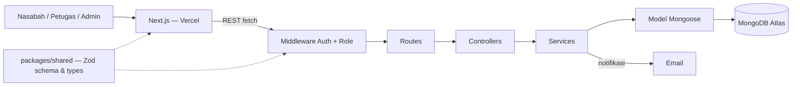

# US4-Bank-Sampah

## Deskripsi Aplikasi

**US4 — Bank sampah: pencatatan setoran & saldo otomatis.** Bank sampah tingkat RW selama ini nyatet setoran nasabah di buku tabungan manual: jenis sampah, berat, dan nilainya, terus dijumlahin jadi saldo yang sewaktu-waktu bisa ditarik jadi uang. Pencatatan manual rawan salah hitung pas petugas ngelayanin banyak nasabah sekaligus, dan kalau buku hilang atau rusak, saldo nasabah gak bisa ditelusuri lagi.

Aplikasi ini mendigitalkan seluruh proses: petugas nimbang dan input data setoran, saldo nasabah terakumulasi otomatis sebagai buku besar, dan nasabah bisa cek saldo sendiri serta ngajuin penarikan (tunai atau e-wallet). Tugas kuliah kelompok.

### Role Pengguna

- **Nasabah** — daftar akun, cek saldo dan riwayat setoran/mutasi, ajuin penarikan (tunai atau e-wallet), lihat titik & jadwal jemput di peta.
- **Petugas** — input hasil timbangan sebagai setoran, proses pengajuan penarikan, batalin setoran yang salah input.
- **Admin** — atur jenis sampah dan harga per kg, kelola akun nasabah & petugas, kelola titik & jadwal jemput, lihat laporan.

Perbedaan wewenang ini jadi titik penerapan otorisasi di API.

### Fitur Inti

- **Jenis & harga sampah** — tiap jenis punya harga per kg sendiri (plastik PET, kardus, kertas, kaleng, botol kaca, dll). Harga bisa berubah kapan aja.
- **Setoran** — tanggal, nasabah, dan rincian jenis sampah × berat × harga. Totalnya otomatis masuk ke saldo nasabah sebagai catatan buku besar.
- **Saldo & buku besar** — tiap perubahan saldo tercatat, jadi saldo selalu bisa ditelusuri.
- **Penarikan** — nasabah ajuin pencairan tunai atau ke dompet digital, petugas proses.
- **Laporan** — total kg dan nilai per jenis sampah per periode, total penarikan, saldo beredar.
- **Titik & jadwal jemput** (nilai tambah) — peta Leaflet titik penjemputan beserta jadwalnya.
- **Email otomatis** (nilai tambah) — nasabah dapet email pas setoran tercatat atau status penarikan berubah.

### Fitur Detail

Saldo disimpan dalam **Rupiah** (bilangan bulat). Harga di-snapshot di tiap item setoran, jadi perubahan harga gak ngubah riwayat. Setoran dan penarikan yang disetujui ditulis dalam satu transaction MongoDB (saldo + buku besar sekaligus). Setoran yang salah gak diedit, tapi dibatalin dengan entri koreksi.

| Fitur | Role | Ringkasan | Endpoint utama |
|---|---|---|---|
| Auth & akun | Semua | Register nasabah, login/logout, password di-hash bcrypt, cek token + role tiap route | `/api/auth/*` |
| Kelola pengguna | Admin | CRUD nasabah & petugas, cari, nonaktifin | `/api/users` |
| Jenis & harga sampah | Admin | CRUD jenis sampah + harga/kg, soft delete kalau udah dipake | `/api/jenis-sampah` |
| Setoran | Petugas | Pilih nasabah, input jenis + berat, total masuk saldo; bisa dibatalin (koreksi) | `/api/setoran` |
| Saldo & buku besar | Nasabah | Lihat saldo + mutasi (SETORAN, PENARIKAN, KOREKSI) | `/api/saldo` |
| Penarikan | Nasabah → Petugas | Ajuin ≤ saldo, metode TUNAI / E_WALLET; petugas setujui/tolak | `/api/penarikan` |
| Laporan | Admin | Total kg & nilai per jenis per periode, total penarikan, saldo beredar, grafik | `/api/laporan` |
| Titik & jadwal jemput | Admin, Nasabah | Admin kelola titik (koordinat + jadwal), nasabah lihat di peta | `/api/titik-jemput` |
| Email otomatis | Sistem | Email ke nasabah pas setoran tercatat & penarikan diproses | — |

### Halaman per Role

- **Nasabah:** login/register, dashboard (saldo + grafik), riwayat, tarik saldo, jadwal jemput, profil
- **Petugas:** dashboard, setoran (input + daftar), penarikan
- **Admin:** dashboard, jenis sampah, pengguna, titik jemput, laporan

## Anggota Tim

4 anggota, pembagian role dev:

- Member A, Member B — Frontend & UI/UX
- Member C, Member D — Backend & Database

## Tech Stack

Sesuai stack wajib rubrik (ExpressJS, MongoDB, Next.js):

- **Backend:** Express.js (TypeScript) di Railway
  - ODM: Mongoose
  - Validasi: Zod
  - Hashing password: bcrypt
- **Database:** MongoDB Atlas (free tier)
- **Frontend:** Next.js (App Router) + TypeScript, di Vercel
  - Styling/UI: Tailwind CSS + shadcn/ui
  - Data fetching: TanStack Query (React Query)
  - Peta: Leaflet (react-leaflet)
- **Email:** Nodemailer / Resend
- **Bentuk repo:** monorepo pakai npm workspaces — `backend/` + `frontend/` + `packages/shared`.
- Frontend manggil Express API langsung (gak ada layer proxy Next.js API routes).

## Arsitektur



Validasi pakai Zod schema yang di-share ke frontend lewat `packages/shared`, jadi frontend dan backend sepakat sama bentuk request/response yang sama.

## Struktur Folder & File

```
paw/
├── backend/                  # Express API
│   ├── src/
│   │   ├── routes/           # auth, users, jenis-sampah, setoran, penarikan, saldo, laporan, titik-jemput
│   │   ├── controllers/      # satu per route group, parse request, panggil service, kirim response
│   │   ├── services/         # business logic: snapshot harga, saldo & mutasi, penarikan, laporan, email
│   │   ├── models/           # schema Mongoose: User, JenisSampah, Setoran, Penarikan, MutasiSaldo, TitikJemput
│   │   ├── middlewares/      # auth, role guard, error handler, validasi Zod
│   │   ├── lib/               # db.ts (koneksi mongoose), mailer.ts, config/env loader
│   │   ├── seed.ts            # admin awal + contoh jenis sampah
│   │   ├── app.ts             # setup Express app + middleware
│   │   └── server.ts          # entrypoint, jalanin HTTP server
│   ├── .env
│   ├── package.json
│   └── tsconfig.json
│
├── frontend/                 # Next.js app (App Router)
│   ├── app/
│   │   ├── (auth)/            # login, register
│   │   ├── nasabah/           # dashboard, riwayat, tarik-saldo, jadwal-jemput, profil
│   │   ├── petugas/           # dashboard, setoran, penarikan
│   │   ├── admin/             # dashboard, jenis-sampah, pengguna, titik-jemput, laporan
│   │   └── layout.tsx, page.tsx
│   ├── components/
│   │   ├── ui/                 # komponen shadcn/ui hasil generate
│   │   └── shared/             # tabel, grafik, peta, form
│   ├── lib/                    # typed API client wrapper, TanStack Query client, utils
│   ├── hooks/                  # contoh: useAuth, useSaldo
│   ├── styles/globals.css
│   ├── package.json
│   └── tsconfig.json
│
├── packages/
│   └── shared/                # Zod schema & TypeScript types yang di-share, plus konstanta (role, metode, status)
│
├── docs/                      # brainstorming, architecture (EN & ID), rubrik.csv, user-story.csv
├── README.md
└── package.json                # root npm workspaces: "workspaces": ["backend", "frontend", "packages/*"]
```

## Open Items

- Mekanisme auth: JWT di httpOnly cookie (rekomendasi) atau session.
- Pencairan e-wallet: transfer manual oleh petugas dulu, payment gateway bisa jadi tambahan nanti.

## Laporan Proyek

Link Google Drive: _belum dibuat — TODO, nyusul_
