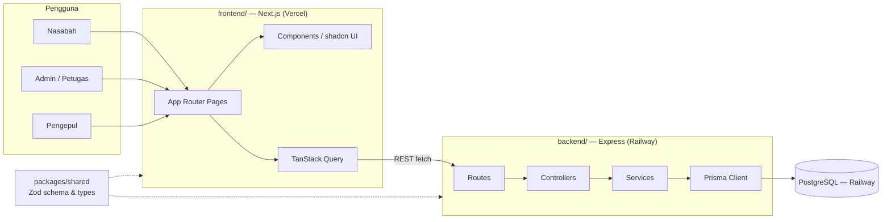
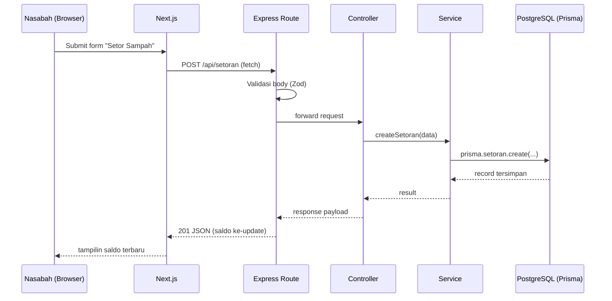
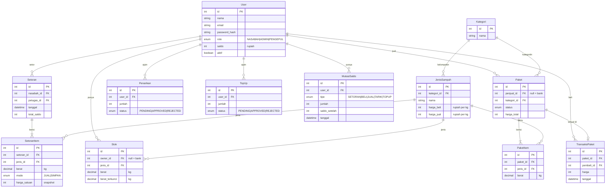

# Bank Sampah App — Arsitektur

## 1. Gambaran Umum Sistem

Arsitektur client-server: frontend Next.js komunikasi ke backend REST API Express.js, yang nyimpen data di PostgreSQL lewat Prisma. Satu monorepo, dikelola pakai npm workspaces, dibagi jadi `backend/`, `frontend/`, dan package `packages/shared` buat types/schema yang dipake bareng kedua sisi.

## 2. Diagram Arsitektur



## 3. Alur Request



Validasi dilakukan di batas route pakai Zod schema (di-share ke frontend lewat `packages/shared`), jadi kedua sisi sepakat sama bentuk request/response yang sama.

## 4. Struktur Repo

```
paw/
├── backend/
├── frontend/
├── packages/
│   └── shared/
├── docs/                (brainstorming.md, architecture.md + versi .id.md)
└── package.json        (root npm workspaces)
```

## 5. `backend/` — Express (layered: routes → controllers → services → Prisma)

```
backend/
├── src/
│   ├── routes/          (nasabah.routes.ts, admin.routes.ts, paket.routes.ts, auth.routes.ts, laporan.routes.ts)
│   ├── controllers/     (satu per route group, parse request, panggil service, kirim response)
│   ├── services/        (business logic: setor sampah, saldo, trading paket, panggil Prisma)
│   ├── middlewares/     (auth, error handler, validasi request pakai Zod)
│   ├── prisma/          (schema.prisma, migrations/)
│   ├── lib/              (Prisma client singleton, config/env loader)
│   ├── app.ts            (setup Express app + middleware)
│   └── server.ts         (entrypoint, jalanin HTTP server)
├── .env
├── package.json
└── tsconfig.json
```

## 6. `frontend/` — Next.js (App Router)

```
frontend/
├── app/
│   ├── (auth)/           (login, register)
│   ├── nasabah/          (dashboard, setor-sampah, riwayat, marketplace, tarik-saldo, profil)
│   ├── admin/            (dashboard, nasabah, setoran, harga-sampah, paket, tarik-saldo, laporan)
│   ├── pengepul/         (dashboard, marketplace, riwayat)
│   └── layout.tsx, page.tsx
├── components/
│   ├── ui/               (komponen shadcn/ui hasil generate)
│   └── shared/           (komponen shared khusus app)
├── lib/                  (typed API client wrapper, TanStack Query client, utils)
├── hooks/                (contoh: useAuth)
├── styles/globals.css
├── package.json
└── tsconfig.json
```

Frontend manggil Express API langsung (gak ada layer proxy Next.js API routes).

## 7. `packages/shared/`

Zod schema + TypeScript types hasil infer buat bentuk request/response API, plus konstanta yang di-share (kategori sampah, role). Di-import sama `backend/` dan `frontend/` sebagai npm workspace package — jaga kontrak dua sub-tim tetep sinkron tanpa duplikat types.

## 8. Root Level

- `package.json` — root npm workspaces: `"workspaces": ["backend", "frontend", "packages/*"]`
- `README.md` tetap di root
- `docs/` — `brainstorming.md`/`brainstorming.id.md`, `architecture.md`/`architecture.id.md`

## 9. Fitur Detail

Uang disimpan dalam **Rupiah**. Jual-beli paket dibayar **pakai saldo di app**. Pas setoran, tiap item bisa:
- **Jual langsung** — bank beli, saldo nasabah nambah, sampah jadi **stok bank**.
- **Simpan sebagai stok** — tetep jadi **stok milik nasabah** di bank, bisa dijual nanti sebagai paket.

### 9.1 Auth & Akun
- **Role:** Nasabah, Pengepul (daftar sendiri), Admin (di-seed).
- **Aturan:** password di-hash (bcrypt); user nonaktif gak bisa login.
- **Endpoint:** `POST /api/auth/register`, `POST /api/auth/login`, `POST /api/auth/logout`, `GET /api/auth/me`
- **Halaman:** `(auth)/login`, `(auth)/register`, `*/profil`

### 9.2 Kelola User (Admin)
- List, cari, nonaktifin nasabah/pengepul.
- **Endpoint:** `GET /api/users`, `PATCH /api/users/:id`
- **Halaman:** `admin/nasabah`

### 9.3 Jenis & Harga Sampah (Admin)
- Tiap jenis sampah masuk satu kategori (contoh: Plastik, Kertas, Logam, Elektronik, Organik).
- Dua harga per kg: `harga_beli` (bank beli dari nasabah pas setoran) dan `harga_jual` (harga paket di marketplace).
- **Endpoint:** `GET /api/jenis-sampah`, `POST /api/jenis-sampah`, `PATCH /api/jenis-sampah/:id`, `DELETE /api/jenis-sampah/:id`
- **Halaman:** `admin/harga-sampah`

### 9.4 Setor Sampah
- Admin catat setoran nasabah: daftar item (jenis sampah + berat kg) dan mode per item (Jual / Simpan).
- Harga di-**snapshot** di tiap item pas setor, jadi perubahan harga nanti gak ngubah riwayat.
- Jual → `saldo += berat × harga_beli`, stok bank nambah. Simpan → stok nasabah nambah.
- **Endpoint:** `POST /api/setoran` (admin), `GET /api/setoran` (admin: semua, nasabah: punya sendiri)
- **Halaman:** `admin/setoran`, `nasabah/setor-sampah` (riwayat + stok saat ini)

### 9.5 Saldo & Mutasi
- Tiap perubahan saldo nulis satu baris `MutasiSaldo` (tipe: SETORAN, BELI, JUAL, TARIK, TOPUP) plus `saldo_setelah` — saldo selalu bisa diaudit.
- **Endpoint:** `GET /api/saldo`, `GET /api/saldo/mutasi`
- **Halaman:** `nasabah/dashboard`, `nasabah/riwayat`, `pengepul/dashboard`

### 9.6 Tarik Saldo
- Nasabah ajuin jumlah ≤ saldo dikurangi pengajuan lain yang masih pending → status `PENDING`.
- Admin approve (saldo dikurangi, catat mutasi) atau reject. Metode pencairan masih belum final (lihat Open Items).
- **Endpoint:** `POST /api/penarikan`, `GET /api/penarikan`, `PATCH /api/penarikan/:id/approve`, `PATCH /api/penarikan/:id/reject`
- **Halaman:** `nasabah/tarik-saldo`, `admin/tarik-saldo`

### 9.7 Top-up (Pengepul)
- Pengepul butuh saldo buat beli paket: ajuin top-up, bayar ke bank di luar app, admin konfirmasi → saldo nambah.
- **Endpoint:** `POST /api/topup`, `GET /api/topup`, `PATCH /api/topup/:id/approve`
- **Halaman:** `pengepul/dashboard`, `admin/tarik-saldo` (view gabungan pengajuan)

### 9.8 Paket
- **Nasabah** bundle stok sendiri: satu kategori, berat per item ≤ stok; stok itu dikunci selama paket di-listing.
- **Admin** bundle stok bank dengan cara yang sama (paket milik bank).
- Admin verifikasi tiap paket → `TERSEDIA`. Harga = Σ(berat × harga_jual), tetap — gak ada nego.
- Alur status: `MENUNGGU_VERIFIKASI → TERSEDIA → TERJUAL`, atau `DIBATALKAN` (pemilik batalin sebelum kejual → stok dibuka lagi).
- **Endpoint:** `POST /api/paket`, `GET /api/paket` (filter kategori/status), `GET /api/paket/:id`, `PATCH /api/paket/:id/verifikasi`, `DELETE /api/paket/:id`
- **Halaman:** `nasabah/marketplace`, `admin/paket`

### 9.9 Beli Paket (Trading)
- Pasangan yang boleh: Nasabah → Pengepul, Nasabah → Nasabah, Bank → Pengepul. Gak bisa beli paket sendiri.
- Saldo pembeli harus ≥ harga. Semua jalan di **satu Prisma `$transaction`**: saldo pembeli −, saldo penjual + (milik bank → kas bank), paket `TERJUAL`, stok terkunci dihapus, dua baris mutasi — gak ada transaksi setengah jadi.
- Barang diambil fisik di bank sampah.
- **Endpoint:** `POST /api/paket/:id/beli`, `GET /api/pembelian`
- **Halaman:** `nasabah/marketplace`, `pengepul/marketplace`, `pengepul/riwayat`

### 9.10 Laporan
- **Admin:** total kg per jenis/kategori per periode, total saldo beredar, jumlah transaksi, estimasi kg sampah yang gak masuk TPA.
- **Nasabah:** ringkasan pribadi (kg disetor, saldo didapat).
- **Endpoint:** `GET /api/laporan/ringkasan?from=&to=`
- **Halaman:** `admin/laporan`, `admin/dashboard`, `nasabah/dashboard`

## 10. Data Model



- Uang pakai `Int` rupiah (gak pakai float → gak ada bug pembulatan). Berat pakai `Decimal(10,2)` kg.
- `Stok` unik di (`owner_id`, `jenis_id`); `owner_id = null` artinya stok bank.

## 11. Open Items (lanjutan dari brainstorming)

- **Metode auth** masih belum final (JWT vs session) — struktur layered ini support dua-duanya lewat `backend/src/middlewares/auth.middleware.ts` tanpa perlu ubah arsitektur lainnya.
- Open question lain (metode tarik saldo, multi-cabang, batasan rubrik dosen) dicatat di `brainstorming.id.md` — gak diputusin ulang di sini.
