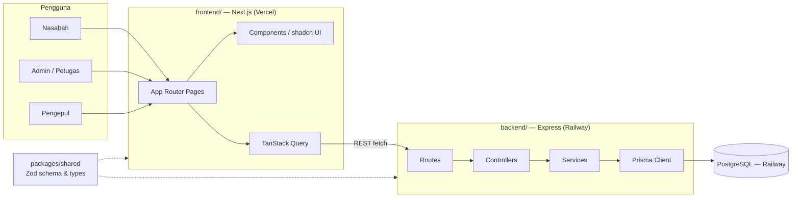
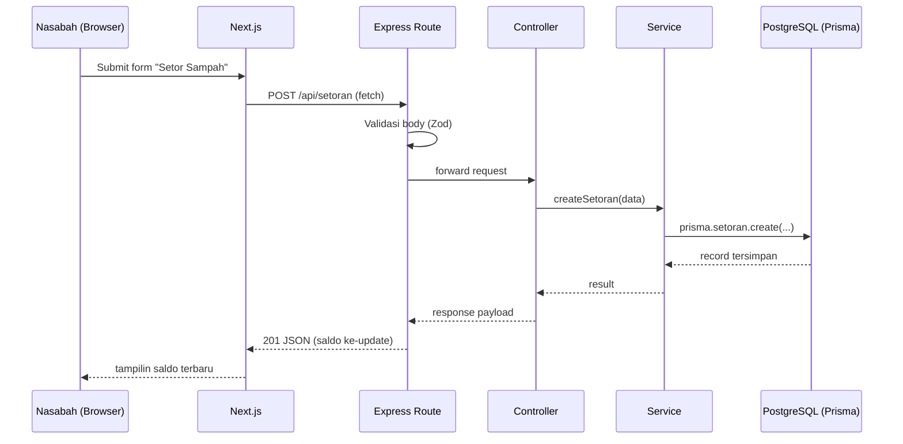

# Bank Sampah App — Arsitektur

## 1. Gambaran Umum Sistem

Arsitektur client-server: frontend Next.js komunikasi ke backend REST API Express.js, yang nyimpen data di PostgreSQL lewat Prisma. Satu monorepo, dikelola pakai npm workspaces, dibagi jadi `backend/`, `frontend/`, dan package `packages/shared` buat types/schema yang dipake bareng kedua sisi.

## 2. Diagram Arsitektur



## 3. Alur Request



Validasi dilakukan di batas route pakai Zod schema (di-share ke frontend lewat `packages/shared`), jadi kedua sisi sepakat sama bentuk request/response yang sama.

## 4. Struktur Repo

```
paw/
├── backend/
├── frontend/
├── packages/
│   └── shared/
├── docs/                (brainstorming.md, architecture.md + versi .id.md)
└── package.json        (root npm workspaces)
```

## 5. `backend/` — Express (layered: routes → controllers → services → Prisma)

```
backend/
├── src/
│   ├── routes/          (nasabah.routes.ts, admin.routes.ts, paket.routes.ts, auth.routes.ts, laporan.routes.ts)
│   ├── controllers/     (satu per route group, parse request, panggil service, kirim response)
│   ├── services/        (business logic: setor sampah, saldo, trading paket, panggil Prisma)
│   ├── middlewares/     (auth, error handler, validasi request pakai Zod)
│   ├── prisma/          (schema.prisma, migrations/)
│   ├── lib/              (Prisma client singleton, config/env loader)
│   ├── app.ts            (setup Express app + middleware)
│   └── server.ts         (entrypoint, jalanin HTTP server)
├── .env
├── package.json
└── tsconfig.json
```

## 6. `frontend/` — Next.js (App Router)

```
frontend/
├── app/
│   ├── (auth)/           (login, register)
│   ├── nasabah/          (dashboard, setor-sampah, riwayat, marketplace, tarik-saldo, profil)
│   ├── admin/            (dashboard, nasabah, setoran, harga-sampah, paket, tarik-saldo, laporan)
│   ├── pengepul/         (dashboard, marketplace, riwayat)
│   └── layout.tsx, page.tsx
├── components/
│   ├── ui/               (komponen shadcn/ui hasil generate)
│   └── shared/           (komponen shared khusus app)
├── lib/                  (typed API client wrapper, TanStack Query client, utils)
├── hooks/                (contoh: useAuth)
├── styles/globals.css
├── package.json
└── tsconfig.json
```

Frontend manggil Express API langsung (gak ada layer proxy Next.js API routes).

## 7. `packages/shared/`

Zod schema + TypeScript types hasil infer buat bentuk request/response API, plus konstanta yang di-share (kategori sampah, role). Di-import sama `backend/` dan `frontend/` sebagai npm workspace package — jaga kontrak dua sub-tim tetep sinkron tanpa duplikat types.

## 8. Root Level

- `package.json` — root npm workspaces: `"workspaces": ["backend", "frontend", "packages/*"]`
- `README.md` tetap di root
- `docs/` — `brainstorming.md`/`brainstorming.id.md`, `architecture.md`/`architecture.id.md`

## 9. Open Items (lanjutan dari brainstorming)

- **Metode auth** masih belum final (JWT vs session) — struktur layered ini support dua-duanya lewat `backend/src/middlewares/auth.middleware.ts` tanpa perlu ubah arsitektur lainnya.
- Open question lain (metode tarik saldo, multi-cabang, batasan rubrik dosen) dicatat di `brainstorming.id.md` — gak diputusin ulang di sini.
