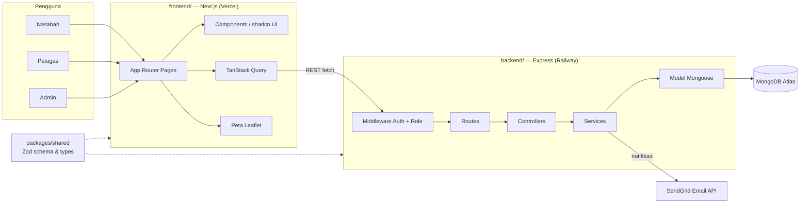
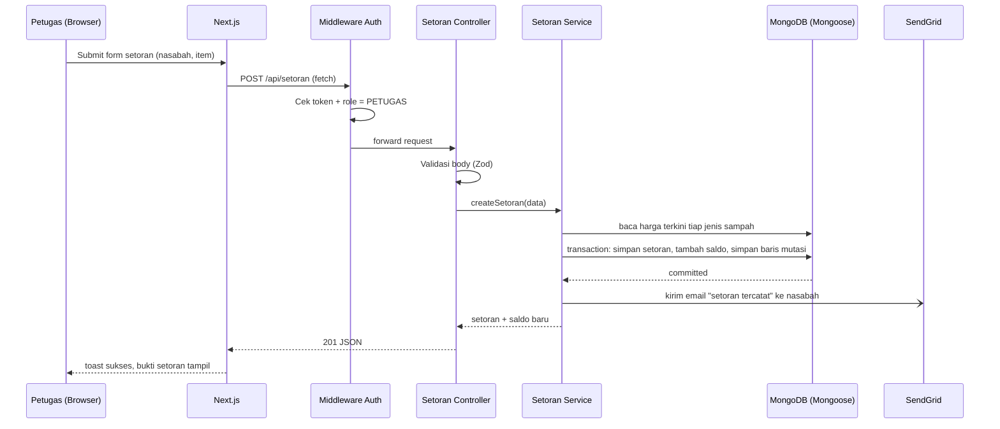
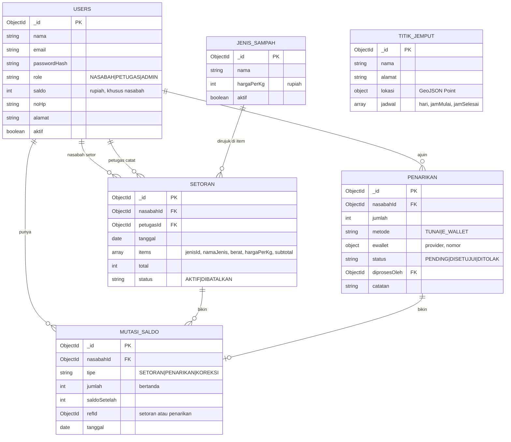

# Bank Sampah App — Arsitektur

## 1. Gambaran Umum Sistem

Arsitektur client-server untuk **US4 — Bank sampah: pencatatan setoran & saldo otomatis**. Frontend Next.js komunikasi ke REST API Express.js, yang nyimpen data di MongoDB (Atlas) lewat Mongoose. Satu monorepo, dikelola pakai npm workspaces: `backend/`, `frontend/`, dan `packages/shared` buat schema/types yang dipake bareng kedua sisi.

Tiga role — **Nasabah**, **Petugas**, **Admin** — masing-masing punya wewenang sendiri; API ngecek wewenang di tiap route.

## 2. Diagram Arsitektur



## 3. Alur Request — Petugas Catat Setoran



Validasi pakai Zod schema yang di-share ke frontend lewat `packages/shared`, jadi kedua sisi sepakat sama bentuk request/response yang sama.

## 4. Struktur Repo

```
paw/
├── backend/
├── frontend/
├── packages/
│   └── shared/
├── docs/                (brainstorming, architecture, rubrik, user story)
└── package.json        (root npm workspaces)
```

## 5. `backend/` — Express (layered: routes → controllers → services → models)

```
backend/
├── src/
│   ├── routes/          (auth, users, jenis-sampah, setoran, penarikan, saldo, laporan, titik-jemput .routes.ts)
│   ├── controllers/     (satu per route group, parse request, panggil service, kirim response)
│   ├── services/        (business logic: snapshot harga, saldo & mutasi, penarikan, laporan, email)
│   ├── models/          (schema Mongoose: User, JenisSampah, Setoran, Penarikan, MutasiSaldo, TitikJemput)
│   ├── middlewares/     (auth, role guard, error handler, validasi request pakai Zod)
│   ├── lib/              (db.ts koneksi mongoose, mailer.ts client SendGrid, config/env loader)
│   ├── seed.ts           (admin awal + contoh jenis sampah)
│   ├── app.ts            (setup Express app + middleware)
│   └── server.ts         (entrypoint, jalanin HTTP server)
├── .env
├── package.json
└── tsconfig.json
```

## 6. `frontend/` — Next.js (App Router)

```
frontend/
├── app/
│   ├── (auth)/           (login, register)
│   ├── nasabah/          (dashboard, riwayat, tarik-saldo, jadwal-jemput, profil)
│   ├── petugas/          (dashboard, setoran, penarikan)
│   ├── admin/            (dashboard, jenis-sampah, pengguna, titik-jemput, laporan)
│   └── layout.tsx, page.tsx
├── components/
│   ├── ui/               (komponen shadcn/ui hasil generate)
│   └── shared/           (komponen shared khusus app: tabel, grafik, peta, form)
├── lib/                  (typed API client wrapper, TanStack Query client, utils)
├── hooks/                (contoh: useAuth, useSaldo)
├── styles/globals.css
├── package.json
└── tsconfig.json
```

Frontend manggil Express API langsung (gak ada layer proxy Next.js API routes). Route group per role juga dijaga di client (redirect kalau role gak cocok), tapi penjaga sebenarnya tetap API.

## 7. `packages/shared/`

Zod schema + TypeScript types hasil infer buat bentuk request/response API, plus konstanta yang di-share (role, metode penarikan, status). Di-import sama `backend/` dan `frontend/` sebagai npm workspace package — jaga kontrak dua sub-tim tetep sinkron tanpa duplikat types.

## 8. Root Level

- `package.json` — root npm workspaces: `"workspaces": ["backend", "frontend", "packages/*"]`
- `README.md` tetap di root
- `docs/` — `brainstorming.md`/`.id.md`, `architecture.md`/`.id.md`, `rubrik.csv`, `user-story.csv`

## 9. Fitur Detail

Uang disimpan dalam **Rupiah** sebagai bilangan bulat. Tiap perubahan saldo lewat buku besar.

### 9.1 Auth & Akun
- **Role:** Nasabah (daftar sendiri), Petugas (dibuat admin), Admin (di-seed).
- **Aturan:** password di-hash pakai bcrypt; user nonaktif gak bisa login; tiap route terproteksi ngecek token + role.
- **Endpoint:** `POST /api/auth/register`, `POST /api/auth/login`, `POST /api/auth/logout`, `GET /api/auth/me`
- **Halaman:** `(auth)/login`, `(auth)/register`, `nasabah/profil`

### 9.2 Kelola Pengguna (Admin)
- CRUD penuh akun nasabah & petugas, cari, nonaktifin.
- **Endpoint:** `GET /api/users`, `GET /api/users/:id`, `POST /api/users`, `PATCH /api/users/:id`, `DELETE /api/users/:id`
- **Halaman:** `admin/pengguna`

### 9.3 Jenis & Harga Sampah (Admin)
- Tiap jenis punya harga per kg (contoh: plastik PET, kardus, kertas, kaleng, botol kaca). Harga bisa berubah kapan aja; setoran tetap nyimpen harga saat dicatat.
- **Endpoint:** `GET /api/jenis-sampah`, `POST /api/jenis-sampah`, `PATCH /api/jenis-sampah/:id`, `DELETE /api/jenis-sampah/:id` (soft delete kalau udah dipake)
- **Halaman:** `admin/jenis-sampah`

### 9.4 Setoran (Petugas)
- Petugas pilih nasabah dan nambahin item: jenis sampah + berat (kg). Server ambil harga terkini, di-snapshot di tiap item, hitung `subtotal = berat × hargaPerKg` dan totalnya.
- Dalam **satu transaction MongoDB**: simpan setoran, tambah total ke saldo nasabah, simpan baris mutasi `SETORAN`.
- Salah input → batalin setoran: status `DIBATALKAN` + baris mutasi `KOREKSI` yang ngebalikin jumlahnya (buku besar gak pernah diedit).
- **Endpoint:** `POST /api/setoran`, `GET /api/setoran` (petugas/admin: semua, nasabah: punya sendiri), `GET /api/setoran/:id`, `PATCH /api/setoran/:id/batal`
- **Halaman:** `petugas/setoran`, `nasabah/riwayat`

### 9.5 Saldo & Buku Besar
- Baris `mutasiSaldo`: tipe `SETORAN`, `PENARIKAN`, atau `KOREKSI`, jumlah bertanda, `saldoSetelah`. Saldo nasabah selalu bisa dihitung ulang dari buku besar.
- **Endpoint:** `GET /api/saldo` (punya sendiri), `GET /api/saldo/mutasi`
- **Halaman:** `nasabah/dashboard`, `nasabah/riwayat`

### 9.6 Penarikan
- Nasabah ajuin jumlah ≤ saldo dikurangi pengajuan lain yang masih pending; metode `TUNAI` atau `E_WALLET` (provider + nomor).
- Petugas setujui (saldo dikurangi + baris mutasi `PENARIKAN`, dalam satu transaction) atau tolak dengan catatan. Email dikirim tiap status berubah.
- **Endpoint:** `POST /api/penarikan`, `GET /api/penarikan`, `PATCH /api/penarikan/:id/setujui`, `PATCH /api/penarikan/:id/tolak`
- **Halaman:** `nasabah/tarik-saldo`, `petugas/penarikan`

### 9.7 Laporan (Admin)
- Total kg dan nilai per jenis sampah per periode, total penarikan, saldo beredar, nasabah paling aktif, grafik per periode.
- **Endpoint:** `GET /api/laporan/ringkasan?from=&to=`, `GET /api/laporan/per-jenis?from=&to=`
- **Halaman:** `admin/laporan`, `admin/dashboard`

### 9.8 Titik & Jadwal Jemput (nilai tambah, Leaflet)
- Admin kelola titik penjemputan: nama, alamat, koordinat GeoJSON, jadwal mingguan (hari + jam). Nasabah lihat di peta.
- **Endpoint:** `GET /api/titik-jemput`, `POST /api/titik-jemput`, `PATCH /api/titik-jemput/:id`, `DELETE /api/titik-jemput/:id`
- **Halaman:** `admin/titik-jemput`, `nasabah/jadwal-jemput`

### 9.9 Email Otomatis (nilai tambah)
- Nasabah dapet email pas setoran tercatat dan pas penarikan disetujui/ditolak. Dikirim setelah transaction DB commit; kalau email gagal, transaction gak di-rollback.
- **Provider:** SendGrid lewat `@sendgrid/mail` — API key di `SENDGRID_API_KEY`, alamat pengirim di `SENDGRID_FROM_EMAIL` (harus verified sender di SendGrid). Free tier cukup buat proyek ini.
- **Lokasi:** `backend/src/lib/mailer.ts` (client SendGrid + template email), dipanggil dari service setoran & penarikan.

### 9.10 UX Pendukung
- Dashboard per role, grafik saldo/setoran, search & filter di tabel, loading skeleton, notifikasi toast, pesan error di form, layout responsif.

## 10. Data Model (collection MongoDB)



- Item setoran di-**embed** (selalu dibaca bareng setorannya) dan bawa snapshot harga.
- Uang pakai integer rupiah (gak pakai float → gak ada bug pembulatan); berat pakai number kg (2 desimal).
- Perubahan saldo + baris mutasi ditulis dalam satu transaction session Mongoose (replica set Atlas).

## 11. Pemetaan Rubrik

| Rubrik | Dipenuhi di |
|---|---|
| BE1 ExpressJS | App Express di `backend/` |
| BE2 MongoDB | MongoDB Atlas + model Mongoose (§10) |
| BE3 CRUD | Pengguna, jenis sampah, titik jemput (CRUD penuh); setoran & penarikan (create/read/update status) |
| BE4 Hashing | Hash password bcrypt (§9.1) |
| BE5 Perlindungan API | Middleware auth + role per route: petugas → setoran/penarikan, nasabah → saldo/penarikan sendiri, admin → harga/pengguna/laporan |
| FE1 Next.js | App Router, route group per role (§6) |
| FE2 Desain → UI | shadcn/ui + Tailwind, layout responsif |
| FE3 Best practices | Komponen shared, hooks, API client di `lib/`, logika terpisah dari tampilan |
| FE4 Interaktivitas | Loading state, toast, error state, efek hover (§9.10) |
| FE5 API + validasi form | TanStack Query + Zod schema dari `packages/shared` |
| G1 Ketepatan fitur | Semua kebutuhan US4 (§9.1–9.7) + fitur pendukung |
| G3 Alur pengembangan | Commit kecil dan rutin (aturan commit repo) |
| G6 Nilai tambah | Peta Leaflet (§9.8), email otomatis (§9.9) |

## 12. Open Items

- **Mekanisme auth:** JWT di httpOnly cookie (rekomendasi; frontend di Vercel dan backend di Railway beda domain → cookie butuh `SameSite=None; Secure`), atau session. Struktur support dua-duanya lewat `backend/src/middlewares/auth.middleware.ts`.
- **Pencairan e-wallet:** transfer manual oleh petugas dulu; disbursement beneran via payment gateway bisa jadi tambahan nanti.
