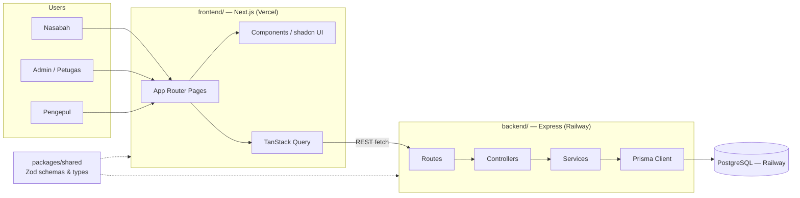
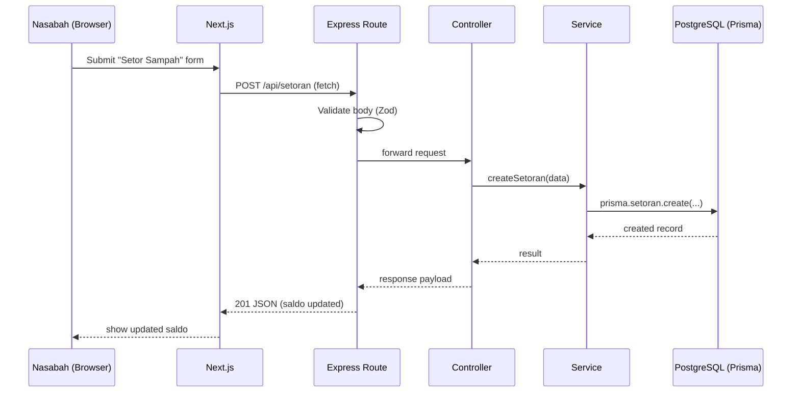
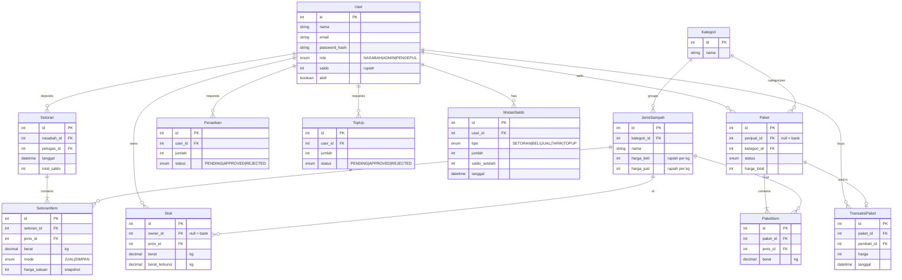

# Bank Sampah App — Architecture

## 1. System Overview

Client-server architecture: a Next.js frontend talks to an Express.js REST API backend, which persists data in PostgreSQL through Prisma. Single monorepo, managed with npm workspaces, split into `backend/`, `frontend/`, and a shared `packages/shared` package for types/schemas used by both sides.

## 2. Architecture Diagram



## 3. Request Flow



Validation happens at the route boundary via Zod schemas (shared with the frontend through `packages/shared`), so both sides agree on the same request/response shape.

## 4. Repo Layout

```
paw/
├── backend/
├── frontend/
├── packages/
│   └── shared/
├── docs/                (brainstorming.md, architecture.md + .id.md versions)
└── package.json        (npm workspaces root)
```

## 5. `backend/` — Express (layered: routes → controllers → services → Prisma)

```
backend/
├── src/
│   ├── routes/          (nasabah.routes.ts, admin.routes.ts, paket.routes.ts, auth.routes.ts, laporan.routes.ts)
│   ├── controllers/     (one per route group, parses request, calls service, sends response)
│   ├── services/        (business logic: setor sampah, saldo, trading paket, calls Prisma)
│   ├── middlewares/     (auth, error handler, Zod request validation)
│   ├── prisma/          (schema.prisma, migrations/)
│   ├── lib/              (Prisma client singleton, env/config loader)
│   ├── app.ts            (Express app + middleware wiring)
│   └── server.ts         (entrypoint, starts the HTTP server)
├── .env
├── package.json
└── tsconfig.json
```

## 6. `frontend/` — Next.js (App Router)

```
frontend/
├── app/
│   ├── (auth)/           (login, register)
│   ├── nasabah/          (dashboard, setor-sampah, riwayat, marketplace, tarik-saldo, profil)
│   ├── admin/            (dashboard, nasabah, setoran, harga-sampah, paket, tarik-saldo, laporan)
│   ├── pengepul/         (dashboard, marketplace, riwayat)
│   └── layout.tsx, page.tsx
├── components/
│   ├── ui/               (shadcn/ui generated components)
│   └── shared/           (app-specific shared components)
├── lib/                  (typed API client wrapper, TanStack Query client, utils)
├── hooks/                (e.g. useAuth)
├── styles/globals.css
├── package.json
└── tsconfig.json
```

The frontend calls the Express API directly (no Next.js API-route proxy layer).

## 7. `packages/shared/`

Zod schemas + inferred TypeScript types for API request/response shapes, plus shared constants (waste categories, roles). Imported by both `backend/` and `frontend/` as an npm workspace package — keeps the two sub-teams' contracts in sync without duplicating types.

## 8. Root Level

- `package.json` — npm workspaces root: `"workspaces": ["backend", "frontend", "packages/*"]`
- `README.md` stays at root
- `docs/` — `brainstorming.md`/`brainstorming.id.md`, `architecture.md`/`architecture.id.md`

## 9. Detailed Features

Money is stored in **Rupiah**. Paket trades are paid **with in-app saldo**. At setoran, each item is either:
- **Jual langsung** — bank buys it, nasabah's saldo is credited, the waste becomes **bank stock**.
- **Simpan sebagai stok** — stays as the **nasabah's stock** at the bank, sellable later as a paket.

### 9.1 Auth & Accounts
- **Roles:** Nasabah, Pengepul (self-register), Admin (seeded).
- **Rules:** passwords hashed (bcrypt); inactive users can't log in.
- **Endpoints:** `POST /api/auth/register`, `POST /api/auth/login`, `POST /api/auth/logout`, `GET /api/auth/me`
- **Pages:** `(auth)/login`, `(auth)/register`, `*/profil`

### 9.2 Manage Users (Admin)
- List, search, deactivate nasabah/pengepul.
- **Endpoints:** `GET /api/users`, `PATCH /api/users/:id`
- **Pages:** `admin/nasabah`

### 9.3 Waste Types & Prices (Admin)
- Each waste type belongs to a category (e.g. Plastik, Kertas, Logam, Elektronik, Organik).
- Two prices per kg: `harga_beli` (bank buys from nasabah at setoran) and `harga_jual` (marketplace paket price).
- **Endpoints:** `GET /api/jenis-sampah`, `POST /api/jenis-sampah`, `PATCH /api/jenis-sampah/:id`, `DELETE /api/jenis-sampah/:id`
- **Pages:** `admin/harga-sampah`

### 9.4 Deposit Waste (Setor Sampah)
- Admin records a setoran for a nasabah: list of items (waste type + weight in kg) and a mode per item (Jual / Simpan).
- Price is **snapshotted** on each item at deposit time, so later price changes don't rewrite history.
- Jual → `saldo += berat × harga_beli`, bank stock +. Simpan → nasabah stock +.
- **Endpoints:** `POST /api/setoran` (admin), `GET /api/setoran` (admin: all, nasabah: own)
- **Pages:** `admin/setoran`, `nasabah/setor-sampah` (history + current stock)

### 9.5 Balance & Ledger
- Every saldo change writes a `MutasiSaldo` row (type: SETORAN, BELI, JUAL, TARIK, TOPUP) with `saldo_setelah` — balance is always auditable.
- **Endpoints:** `GET /api/saldo`, `GET /api/saldo/mutasi`
- **Pages:** `nasabah/dashboard`, `nasabah/riwayat`, `pengepul/dashboard`

### 9.6 Withdraw (Tarik Saldo)
- Nasabah requests an amount ≤ saldo minus other pending requests → status `PENDING`.
- Admin approves (saldo deducted, ledger row) or rejects. Payout method still TBD (see Open Items).
- **Endpoints:** `POST /api/penarikan`, `GET /api/penarikan`, `PATCH /api/penarikan/:id/approve`, `PATCH /api/penarikan/:id/reject`
- **Pages:** `nasabah/tarik-saldo`, `admin/tarik-saldo`

### 9.7 Top-up (Pengepul)
- Pengepul needs saldo to buy paket: requests a top-up, pays the bank outside the app, admin confirms → saldo credited.
- **Endpoints:** `POST /api/topup`, `GET /api/topup`, `PATCH /api/topup/:id/approve`
- **Pages:** `pengepul/dashboard`, `admin/tarik-saldo` (combined requests view)

### 9.8 Paket
- **Nasabah** bundles their own stock: one category, weight per item ≤ their stock; that stock is locked while the paket is listed.
- **Admin** bundles bank stock the same way (bank-owned paket).
- Admin verifies each paket → `TERSEDIA`. Price = Σ(berat × harga_jual), fixed — no negotiation.
- Status flow: `MENUNGGU_VERIFIKASI → TERSEDIA → TERJUAL`, or `DIBATALKAN` (owner cancels before sale → stock unlocked).
- **Endpoints:** `POST /api/paket`, `GET /api/paket` (filter by kategori/status), `GET /api/paket/:id`, `PATCH /api/paket/:id/verifikasi`, `DELETE /api/paket/:id`
- **Pages:** `nasabah/marketplace`, `admin/paket`

### 9.9 Buy Paket (Trading)
- Allowed pairs: Nasabah → Pengepul, Nasabah → Nasabah, Bank → Pengepul. Can't buy your own paket.
- Buyer saldo must be ≥ price. Everything runs in **one Prisma `$transaction`**: buyer saldo −, seller saldo + (bank-owned → bank cash account), paket `TERJUAL`, locked stock removed, two ledger rows — no half-finished trades.
- Physical pickup happens at the bank sampah.
- **Endpoints:** `POST /api/paket/:id/beli`, `GET /api/pembelian`
- **Pages:** `nasabah/marketplace`, `pengepul/marketplace`, `pengepul/riwayat`

### 9.10 Reports
- **Admin:** total kg per type/category per period, total saldo in circulation, transaction count, estimated kg diverted from landfill.
- **Nasabah:** personal totals (kg deposited, saldo earned).
- **Endpoints:** `GET /api/laporan/ringkasan?from=&to=`
- **Pages:** `admin/laporan`, `admin/dashboard`, `nasabah/dashboard`

## 10. Data Model



- Money as `Int` rupiah (no floats → no rounding bugs). Weight as `Decimal(10,2)` kg.
- `Stok` unique on (`owner_id`, `jenis_id`); `owner_id = null` means bank stock.

## 11. Open Items (carried over from brainstorming)

- **Auth method** still TBD (JWT vs session) — the layered structure supports either via `backend/src/middlewares/auth.middleware.ts` without changing the rest of the architecture.
- Other open questions (withdrawal method, multi-branch, grading-rubric constraints) tracked in `brainstorming.md` — not re-decided here.
