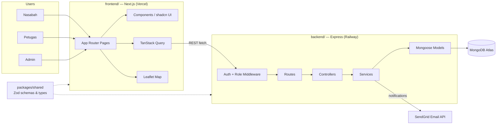
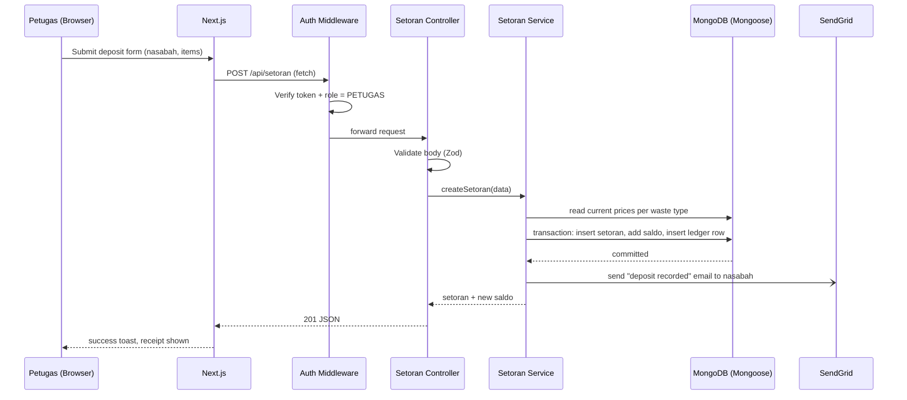
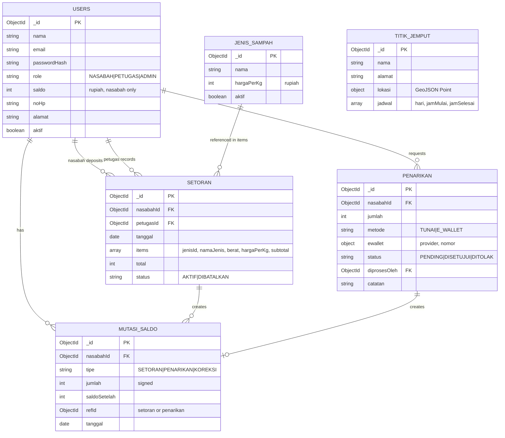

# Bank Sampah App — Architecture

## 1. System Overview

Client-server architecture for **US4 — Bank sampah: automatic deposit & balance recording**. A Next.js frontend talks to an Express.js REST API, which stores data in MongoDB (Atlas) through Mongoose. Single monorepo managed with npm workspaces: `backend/`, `frontend/`, and `packages/shared` for schemas/types used by both sides.

Three roles — **Nasabah**, **Petugas**, **Admin** — each with its own permissions; the API enforces them on every route.

## 2. Architecture Diagram



## 3. Request Flow — Petugas Records a Deposit



Validation happens with Zod schemas shared with the frontend through `packages/shared`, so both sides agree on the same request/response shape.

## 4. Repo Layout

```
paw/
├── backend/
├── frontend/
├── packages/
│   └── shared/
├── docs/                (brainstorming, architecture, rubric, user story)
└── package.json        (npm workspaces root)
```

## 5. `backend/` — Express (layered: routes → controllers → services → models)

```
backend/
├── src/
│   ├── routes/          (auth, users, jenis-sampah, setoran, penarikan, saldo, laporan, titik-jemput .routes.ts)
│   ├── controllers/     (one per route group, parses request, calls service, sends response)
│   ├── services/        (business logic: price snapshot, saldo & ledger, withdrawals, reports, email)
│   ├── models/          (Mongoose schemas: User, JenisSampah, Setoran, Penarikan, MutasiSaldo, TitikJemput)
│   ├── middlewares/     (auth, role guard, error handler, Zod request validation)
│   ├── lib/              (db.ts mongoose connect, mailer.ts SendGrid client, env/config loader)
│   ├── seed.ts           (initial admin + sample waste types)
│   ├── app.ts            (Express app + middleware wiring)
│   └── server.ts         (entrypoint, starts the HTTP server)
├── .env
├── package.json
└── tsconfig.json
```

## 6. `frontend/` — Next.js (App Router)

```
frontend/
├── app/
│   ├── (auth)/           (login, register)
│   ├── nasabah/          (dashboard, riwayat, tarik-saldo, jadwal-jemput, profil)
│   ├── petugas/          (dashboard, setoran, penarikan)
│   ├── admin/            (dashboard, jenis-sampah, pengguna, titik-jemput, laporan)
│   └── layout.tsx, page.tsx
├── components/
│   ├── ui/               (shadcn/ui generated components)
│   └── shared/           (app-specific shared components: tables, charts, map, forms)
├── lib/                  (typed API client wrapper, TanStack Query client, utils)
├── hooks/                (e.g. useAuth, useSaldo)
├── styles/globals.css
├── package.json
└── tsconfig.json
```

The frontend calls the Express API directly (no Next.js API-route proxy layer). Route groups per role are protected on the client too (redirect if role mismatch), but the API is the real guard.

## 7. `packages/shared/`

Zod schemas + inferred TypeScript types for API request/response shapes, plus shared constants (roles, withdrawal methods, statuses). Imported by both `backend/` and `frontend/` as an npm workspace package — keeps the two sub-teams' contracts in sync without duplicating types.

## 8. Root Level

- `package.json` — npm workspaces root: `"workspaces": ["backend", "frontend", "packages/*"]`
- `README.md` stays at root
- `docs/` — `brainstorming.md`/`.id.md`, `architecture.md`/`.id.md`, `rubrik.csv`, `user-story.csv`

## 9. Detailed Features

Money is stored in **Rupiah** as integers. Every balance change goes through the ledger.

### 9.1 Auth & Accounts
- **Roles:** Nasabah (self-register), Petugas (created by admin), Admin (seeded).
- **Rules:** passwords hashed with bcrypt; inactive users can't log in; every protected route checks token + role.
- **Endpoints:** `POST /api/auth/register`, `POST /api/auth/login`, `POST /api/auth/logout`, `GET /api/auth/me`
- **Pages:** `(auth)/login`, `(auth)/register`, `nasabah/profil`

### 9.2 Manage Users (Admin)
- Full CRUD for nasabah & petugas accounts, search, deactivate.
- **Endpoints:** `GET /api/users`, `GET /api/users/:id`, `POST /api/users`, `PATCH /api/users/:id`, `DELETE /api/users/:id`
- **Pages:** `admin/pengguna`

### 9.3 Waste Types & Prices (Admin)
- Each type has a price per kg (e.g. PET plastic, cardboard, paper, cans, glass bottles). Price can change anytime; deposits keep the price they were recorded with.
- **Endpoints:** `GET /api/jenis-sampah`, `POST /api/jenis-sampah`, `PATCH /api/jenis-sampah/:id`, `DELETE /api/jenis-sampah/:id` (soft delete if already used)
- **Pages:** `admin/jenis-sampah`

### 9.4 Deposit (Petugas)
- Petugas picks a nasabah and adds line items: waste type + weight (kg). Server looks up the current price, snapshots it on each item, computes `subtotal = berat × hargaPerKg` and the total.
- In **one MongoDB transaction**: insert setoran, add total to nasabah saldo, insert a `SETORAN` ledger row.
- Wrong entry → cancel the setoran: status `DIBATALKAN` + a `KOREKSI` ledger row that reverses the amount (ledger is never edited).
- **Endpoints:** `POST /api/setoran`, `GET /api/setoran` (petugas/admin: all, nasabah: own), `GET /api/setoran/:id`, `PATCH /api/setoran/:id/batal`
- **Pages:** `petugas/setoran`, `nasabah/riwayat`

### 9.5 Balance & Ledger
- `mutasiSaldo` rows: type `SETORAN`, `PENARIKAN`, or `KOREKSI`, signed amount, `saldoSetelah`. A nasabah's saldo can always be rebuilt from the ledger.
- **Endpoints:** `GET /api/saldo` (own), `GET /api/saldo/mutasi`
- **Pages:** `nasabah/dashboard`, `nasabah/riwayat`

### 9.6 Withdrawal
- Nasabah requests an amount ≤ saldo minus other pending requests; method `TUNAI` (cash) or `E_WALLET` (provider + number).
- Petugas approves (saldo deducted + `PENARIKAN` ledger row, in one transaction) or rejects with a note. Email sent on status change.
- **Endpoints:** `POST /api/penarikan`, `GET /api/penarikan`, `PATCH /api/penarikan/:id/setujui`, `PATCH /api/penarikan/:id/tolak`
- **Pages:** `nasabah/tarik-saldo`, `petugas/penarikan`

### 9.7 Reports (Admin)
- Total kg and value per waste type per period, total withdrawals, balance in circulation, most active nasabah, charts per period.
- **Endpoints:** `GET /api/laporan/ringkasan?from=&to=`, `GET /api/laporan/per-jenis?from=&to=`
- **Pages:** `admin/laporan`, `admin/dashboard`

### 9.8 Pickup Points & Schedule (value-add, Leaflet)
- Admin manages pickup points: name, address, GeoJSON coordinates, weekly schedule (day + time range). Nasabah sees them on a map.
- **Endpoints:** `GET /api/titik-jemput`, `POST /api/titik-jemput`, `PATCH /api/titik-jemput/:id`, `DELETE /api/titik-jemput/:id`
- **Pages:** `admin/titik-jemput`, `nasabah/jadwal-jemput`

### 9.9 Automatic Email (value-add)
- Nasabah receives an email when a deposit is recorded and when a withdrawal is approved/rejected. Sent after the DB transaction commits; a mail failure never rolls back the transaction.
- **Provider:** SendGrid via `@sendgrid/mail` — API key in `SENDGRID_API_KEY`, sender address in `SENDGRID_FROM_EMAIL` (must be a verified sender in SendGrid). Free tier is enough for this project.
- **Where:** `backend/src/lib/mailer.ts` (SendGrid client + email templates), called from setoran & penarikan services.

### 9.10 Supporting UX
- Dashboard per role, saldo/deposit charts, search & filter on tables, loading skeletons, toast notifications, inline form errors, responsive layout.

## 10. Data Model (MongoDB collections)



- Setoran items are **embedded** (always read with their setoran) and carry a price snapshot.
- Money as integer rupiah (no floats → no rounding bugs); weight as number in kg (2 decimals).
- Saldo changes + ledger rows are written in one Mongoose session transaction (Atlas replica set).

## 11. Rubric Mapping

| Rubric | Where it's covered |
|---|---|
| BE1 ExpressJS | `backend/` Express app |
| BE2 MongoDB | MongoDB Atlas + Mongoose models (§10) |
| BE3 CRUD | Users, waste types, pickup points (full CRUD); setoran & penarikan (create/read/update status) |
| BE4 Hashing | bcrypt password hash (§9.1) |
| BE5 API protection | Auth + role middleware per route: petugas → setoran/penarikan, nasabah → own saldo/withdrawal, admin → prices/users/reports |
| FE1 Next.js | App Router, route group per role (§6) |
| FE2 Design → UI | shadcn/ui + Tailwind, responsive layouts |
| FE3 Best practices | Shared components, hooks, API client in `lib/`, logic separated from UI |
| FE4 Interactivity | Loading states, toasts, error states, hover effects (§9.10) |
| FE5 API + form validation | TanStack Query + Zod schemas from `packages/shared` |
| G1 Feature fit | All US4 requirements (§9.1–9.7) + supporting features |
| G3 Dev flow | Small, frequent commits (repo commit rule) |
| G6 Value-add | Leaflet map (§9.8), automatic email (§9.9) |

## 12. Open Items

- **Auth mechanism:** JWT in httpOnly cookie recommended (frontend on Vercel and backend on Railway are different domains → cookie needs `SameSite=None; Secure`), or session. Structure supports either via `backend/src/middlewares/auth.middleware.ts`.
- **E-wallet payout:** manual transfer by petugas for now; real disbursement via payment gateway is a possible later add-on.
