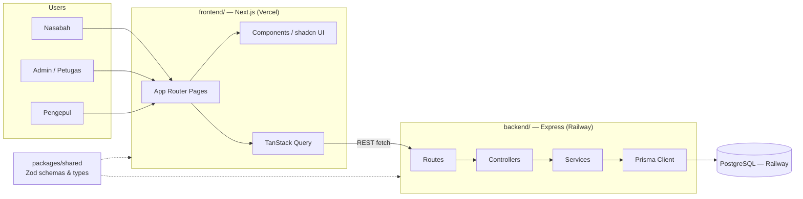
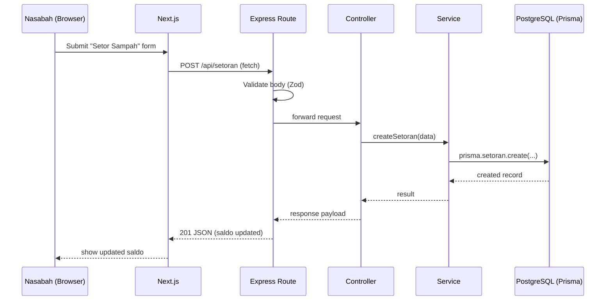

# Bank Sampah App — Architecture

## 1. System Overview

Client-server architecture: a Next.js frontend talks to an Express.js REST API backend, which persists data in PostgreSQL through Prisma. Single monorepo, managed with npm workspaces, split into `backend/`, `frontend/`, and a shared `packages/shared` package for types/schemas used by both sides.

## 2. Architecture Diagram



## 3. Request Flow



Validation happens at the route boundary via Zod schemas (shared with the frontend through `packages/shared`), so both sides agree on the same request/response shape.

## 4. Repo Layout

```
paw/
├── backend/
├── frontend/
├── packages/
│   └── shared/
├── docs/                (brainstorming.md, architecture.md + .id.md versions)
└── package.json        (npm workspaces root)
```

## 5. `backend/` — Express (layered: routes → controllers → services → Prisma)

```
backend/
├── src/
│   ├── routes/          (nasabah.routes.ts, admin.routes.ts, paket.routes.ts, auth.routes.ts, laporan.routes.ts)
│   ├── controllers/     (one per route group, parses request, calls service, sends response)
│   ├── services/        (business logic: setor sampah, saldo, trading paket, calls Prisma)
│   ├── middlewares/     (auth, error handler, Zod request validation)
│   ├── prisma/          (schema.prisma, migrations/)
│   ├── lib/              (Prisma client singleton, env/config loader)
│   ├── app.ts            (Express app + middleware wiring)
│   └── server.ts         (entrypoint, starts the HTTP server)
├── .env
├── package.json
└── tsconfig.json
```

## 6. `frontend/` — Next.js (App Router)

```
frontend/
├── app/
│   ├── (auth)/           (login, register)
│   ├── nasabah/          (dashboard, setor-sampah, riwayat, marketplace, tarik-saldo, profil)
│   ├── admin/            (dashboard, nasabah, setoran, harga-sampah, paket, tarik-saldo, laporan)
│   ├── pengepul/         (dashboard, marketplace, riwayat)
│   └── layout.tsx, page.tsx
├── components/
│   ├── ui/               (shadcn/ui generated components)
│   └── shared/           (app-specific shared components)
├── lib/                  (typed API client wrapper, TanStack Query client, utils)
├── hooks/                (e.g. useAuth)
├── styles/globals.css
├── package.json
└── tsconfig.json
```

The frontend calls the Express API directly (no Next.js API-route proxy layer).

## 7. `packages/shared/`

Zod schemas + inferred TypeScript types for API request/response shapes, plus shared constants (waste categories, roles). Imported by both `backend/` and `frontend/` as an npm workspace package — keeps the two sub-teams' contracts in sync without duplicating types.

## 8. Root Level

- `package.json` — npm workspaces root: `"workspaces": ["backend", "frontend", "packages/*"]`
- `README.md` stays at root
- `docs/` — `brainstorming.md`/`brainstorming.id.md`, `architecture.md`/`architecture.id.md`

## 9. Open Items (carried over from brainstorming)

- **Auth method** still TBD (JWT vs session) — the layered structure supports either via `backend/src/middlewares/auth.middleware.ts` without changing the rest of the architecture.
- Other open questions (withdrawal method, multi-branch, grading-rubric constraints) tracked in `brainstorming.md` — not re-decided here.
