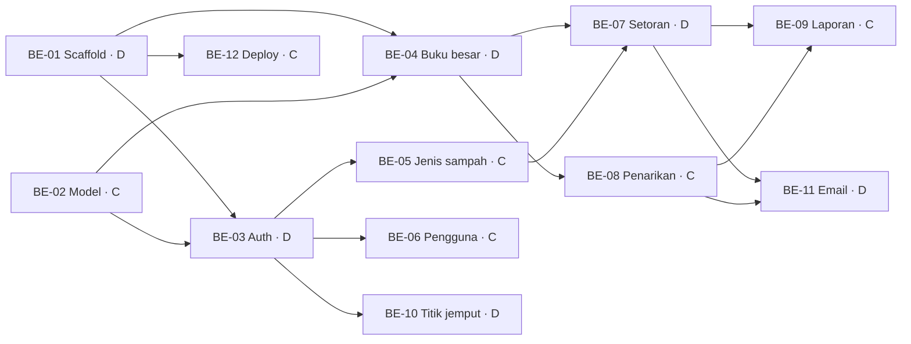

# Bank Sampah App — Pembagian Tugas

Backend dibagi antara **Member C** dan **Member D**. Frontend (Member A, Member B) nyusul.

Rubrik nilai tiap orang dari penyelesaian bagian yang udah disepakati (G2) dan nilai tim dari riwayat commit yang bertahap (G3), jadi tiap tugas punya satu pemilik jelas dan cukup kecil buat dikerjain dalam beberapa commit.

## 1. Ringkasan

| ID | Tugas | Pemilik | Fase | Bergantung ke |
|---|---|---|---|---|
| BE-01 | Workspace + scaffold backend | D | 0 — Fondasi | — |
| BE-02 | Model Mongoose + seed | C | 0 — Fondasi | — |
| BE-03 | Auth + middleware role | D | 1 — Inti | BE-01, BE-02 |
| BE-04 | Service buku besar (saldo & mutasi) | D | 1 — Inti | BE-01, BE-02 |
| BE-05 | CRUD jenis & harga sampah | C | 1 — Inti | BE-02, BE-03 |
| BE-06 | CRUD pengguna | C | 1 — Inti | BE-02, BE-03 |
| BE-07 | Setoran | D | 2 — Alur uang | BE-04, BE-05 |
| BE-08 | Penarikan | C | 2 — Alur uang | BE-04 |
| BE-09 | Laporan | C | 3 — Laporan & tambahan | BE-07, BE-08 |
| BE-10 | Titik & jadwal jemput | D | 3 — Laporan & tambahan | BE-03 |
| BE-11 | Email SendGrid | D | 3 — Laporan & tambahan | BE-07, BE-08 |
| BE-12 | Deployment (Atlas + Railway) | C | 3 — Laporan & tambahan | BE-01 |

**Member D:** scaffold, auth & keamanan, buku besar, setoran, titik jemput, email.
**Member C:** model & seed, jenis sampah, pengguna, penarikan, laporan, deployment.

## 2. Detail Tugas

### Fase 0 — Fondasi (C dan D kerja paralel)

#### BE-01 — Workspace + scaffold backend (Member D)
- Root `package.json` pakai npm workspaces (`backend`, `frontend`, `packages/*`).
- `backend/`: Express + TypeScript, `tsconfig.json`, script dev (tsx/nodemon), `app.ts`, `server.ts`.
- `lib/config.ts` env loader (divalidasi Zod), `lib/db.ts` koneksi Mongoose.
- `middlewares/error.middleware.ts` (error handler terpusat, bentuk error JSON konsisten), `middlewares/validate.middleware.ts` (validasi body/query pakai Zod).
- Package `packages/shared/` di-setup dan bisa di-import dari `backend/`.
- `GET /api/health` balikin OK + status DB.
- **File:** `package.json`, `backend/src/{app,server}.ts`, `backend/src/lib/{config,db}.ts`, `backend/src/middlewares/*`, `packages/shared/*`

#### BE-02 — Model Mongoose + seed (Member C)
- Schema: `User`, `JenisSampah`, `Setoran` (item di-embed), `Penarikan`, `MutasiSaldo`, `TitikJemput` — field sesuai `architecture.id.md` §10.
- Index: `email` unik, `mutasiSaldo` per `nasabahId + tanggal`, `2dsphere` di `titikJemput.lokasi`.
- `seed.ts`: satu akun admin, satu petugas, contoh jenis sampah (plastik PET, kardus, kertas, kaleng, botol kaca).
- **File:** `backend/src/models/*`, `backend/src/seed.ts`

### Fase 1 — Inti

#### BE-03 — Auth + middleware role (Member D)
- `POST /api/auth/register` (khusus nasabah), `POST /api/auth/login`, `POST /api/auth/logout`, `GET /api/auth/me`.
- Hash password bcrypt (rubrik BE4); JWT di httpOnly cookie; user nonaktif ditolak.
- `auth.middleware.ts` (verifikasi token) + guard `requireRole(...roles)` (rubrik BE5) — dipake semua tugas lain.
- **File:** `routes/auth.routes.ts`, `controllers/auth.controller.ts`, `services/auth.service.ts`, `middlewares/auth.middleware.ts`

#### BE-04 — Service buku besar (Member D)
- `ledger.service.ts`: `applyMutasi(session, { nasabahId, tipe, jumlah, refId })` update saldo dan nulis baris `mutasiSaldo` plus `saldoSetelah`, di dalam session Mongoose milik pemanggil. Ditolak kalau saldo jadi minus.
- `GET /api/saldo` (saldo sendiri), `GET /api/saldo/mutasi` (paginated; nasabah: punya sendiri; petugas/admin: `?nasabahId=`).
- Helper bersama `withTransaction(fn)` di `lib/db.ts`.
- **File:** `services/ledger.service.ts`, `routes/saldo.routes.ts`, `controllers/saldo.controller.ts`

#### BE-05 — CRUD jenis & harga sampah (Member C)
- `GET /api/jenis-sampah` (semua role), `POST`, `PATCH /:id`, `DELETE /:id` (khusus admin; soft delete lewat `aktif=false` kalau udah dipake di setoran).
- **File:** `routes/jenis-sampah.routes.ts`, `controllers/jenis-sampah.controller.ts`, `services/jenis-sampah.service.ts`

#### BE-06 — CRUD pengguna (Member C)
- Khusus admin: `GET /api/users` (cari, filter role, paginate), `GET /:id`, `POST` (bikin petugas/nasabah), `PATCH /:id` (edit, nonaktifin), `DELETE /:id`.
- `passwordHash` gak pernah dikirim di response.
- **File:** `routes/users.routes.ts`, `controllers/users.controller.ts`, `services/users.service.ts`

### Fase 2 — Alur uang

#### BE-07 — Setoran (Member D)
- `POST /api/setoran` (petugas): ambil harga terkini, snapshot per item, hitung subtotal + total, lalu dalam satu transaction simpan setoran + `applyMutasi(SETORAN)`.
- `GET /api/setoran` (petugas/admin: semua dengan filter; nasabah: punya sendiri), `GET /api/setoran/:id`.
- `PATCH /api/setoran/:id/batal` (petugas/admin): status `DIBATALKAN` + `applyMutasi(KOREKSI, -total)`.
- **File:** `routes/setoran.routes.ts`, `controllers/setoran.controller.ts`, `services/setoran.service.ts`

#### BE-08 — Penarikan (Member C)
- `POST /api/penarikan` (nasabah): jumlah ≤ saldo − total pending; metode `TUNAI` atau `E_WALLET` (provider + nomor wajib).
- `GET /api/penarikan` (nasabah: punya sendiri; petugas/admin: semua, filter status).
- `PATCH /api/penarikan/:id/setujui` (petugas): dalam satu transaction set status + `applyMutasi(PENARIKAN)`. `PATCH /:id/tolak` pakai catatan.
- **File:** `routes/penarikan.routes.ts`, `controllers/penarikan.controller.ts`, `services/penarikan.service.ts`

### Fase 3 — Laporan & tambahan

#### BE-09 — Laporan (Member C)
- Khusus admin. Pakai aggregation pipeline MongoDB.
- `GET /api/laporan/ringkasan?from=&to=`: total kg, total nilai, total penarikan, saldo beredar, jumlah nasabah aktif, nasabah paling aktif.
- `GET /api/laporan/per-jenis?from=&to=`: kg + nilai per jenis sampah, dikelompokin per hari/bulan buat grafik.
- **File:** `routes/laporan.routes.ts`, `controllers/laporan.controller.ts`, `services/laporan.service.ts`

#### BE-10 — Titik & jadwal jemput (Member D)
- `GET /api/titik-jemput` (semua role), `POST`, `PATCH /:id`, `DELETE /:id` (khusus admin).
- Validasi GeoJSON point (lng, lat) dan entri jadwal (hari, jam mulai, jam selesai).
- **File:** `routes/titik-jemput.routes.ts`, `controllers/titik-jemput.controller.ts`, `services/titik-jemput.service.ts`

#### BE-11 — Email SendGrid (Member D)
- `lib/mailer.ts`: client SendGrid (`@sendgrid/mail`), template "setoran tercatat" dan "penarikan disetujui/ditolak".
- Dipanggil setelah transaction commit di service setoran & penarikan; kalau gagal cuma di-log, gak dilempar ke client.
- Env: `SENDGRID_API_KEY`, `SENDGRID_FROM_EMAIL` (verified sender).
- Koordinasi sama Member C buat hook di `penarikan.service.ts`.
- **File:** `backend/src/lib/mailer.ts`, hook kecil di `services/setoran.service.ts` dan `services/penarikan.service.ts`

#### BE-12 — Deployment (Member C)
- Cluster MongoDB Atlas M0, user DB, network access buat Railway.
- Service Railway buat `backend/`, command build + start, env var (`MONGODB_URI`, `JWT_SECRET`, key SendGrid, `FRONTEND_URL`).
- CORS allow-list domain Vercel; cookie `SameSite=None; Secure` di production.
- Jalanin seed pas deploy pertama; share URL API publik ke member frontend.

## 3. Definition of Done (tiap tugas)

- Zod schema request/response ada di `packages/shared` dan dipake buat validasi.
- Role guard bener di tiap route.
- Dites manual pakai Postman collection bersama (`docs/postman/`), termasuk satu kasus gagal (role salah, body invalid).
- Endpoint masuk ke collection lengkap dengan contoh request.
- Commit kecil sesuai aturan repo (`type(scope): message`, satu perubahan per commit).

## 4. Kesepakatan Kerja

- Satu branch per tugas: `be/<id>-<nama-singkat>` (contoh `be/07-setoran`).
- Buka PR ke `main`; member backend yang lain review dulu sebelum merge.
- Perubahan schema di `packages/shared` diumumin ke seluruh tim — frontend bergantung ke situ.
- Ke-block dependency? Kerjain pakai schema yang udah disepakati di `packages/shared` dan stub bagian yang belum ada sampai jadi.

## 5. Frontend — Menyusul

Tugas Member A dan Member B ditambahin setelah kontrak API backend (Fase 1) stabil.
