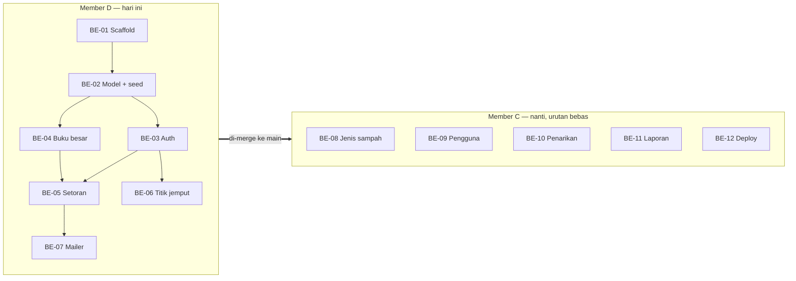

# Bank Sampah App — Pembagian Tugas

Backend dibagi antara **Member C** dan **Member D**. Frontend (Member A, Member B) nyusul.

**Model serah terima:** Member D ngerjain duluan dan nyelesain semuanya sekaligus. Member C lanjut nanti dari `main`. Jadi **gak ada tugas Member D yang bergantung ke Member C**, dan tugas Member C cuma bergantung ke kerjaan Member D yang udah di-merge. Tugas Member C juga gak saling bergantung, jadi bisa dikerjain urutan bebas.

Rubrik nilai tiap orang dari penyelesaian bagian yang udah disepakati (G2) dan nilai tim dari riwayat commit yang bertahap (G3), jadi tiap tugas punya satu pemilik jelas dan dikerjain dalam beberapa commit kecil.

## 1. Ringkasan

| ID | Tugas | Pemilik | Bergantung ke |
|---|---|---|---|
| BE-01 | Workspace + scaffold backend | D | — |
| BE-02 | Model Mongoose + seed | D | BE-01 |
| BE-03 | Auth + middleware role | D | BE-02 |
| BE-04 | Service buku besar (saldo & mutasi) | D | BE-02 |
| BE-05 | Setoran | D | BE-03, BE-04 |
| BE-06 | Titik & jadwal jemput | D | BE-03 |
| BE-07 | Mailer SendGrid + email setoran | D | BE-05 |
| BE-08 | CRUD jenis & harga sampah | C | Kerjaan Member D |
| BE-09 | CRUD pengguna | C | Kerjaan Member D |
| BE-10 | Penarikan + email | C | Kerjaan Member D |
| BE-11 | Laporan | C | Kerjaan Member D |
| BE-12 | Deployment (Atlas + Railway) | C | Kerjaan Member D |

**Member D:** scaffold, model & seed, auth & keamanan, buku besar, setoran, titik jemput, mailer.
**Member C:** jenis sampah, pengguna, penarikan, laporan, deployment.

## 2. Detail Tugas

### Member D

#### BE-01 — Workspace + scaffold backend
- Root `package.json` pakai npm workspaces (`backend`, `frontend`, `packages/*`).
- `backend/`: Express + TypeScript, `tsconfig.json`, script dev (tsx/nodemon), `app.ts`, `server.ts`.
- `lib/config.ts` env loader (divalidasi Zod), `lib/db.ts` koneksi Mongoose + helper `withTransaction(fn)`.
- `middlewares/error.middleware.ts` (error handler terpusat, bentuk error JSON konsisten), `middlewares/validate.middleware.ts` (validasi body/query pakai Zod).
- Package `packages/shared/` di-setup dan bisa di-import dari `backend/`.
- `GET /api/health` balikin OK + status DB.
- **File:** `package.json`, `backend/src/{app,server}.ts`, `backend/src/lib/{config,db}.ts`, `backend/src/middlewares/*`, `packages/shared/*`

#### BE-02 — Model Mongoose + seed
- Semua schema: `User`, `JenisSampah`, `Setoran` (item di-embed), `Penarikan`, `MutasiSaldo`, `TitikJemput` — field sesuai `architecture.id.md` §10. Termasuk `Penarikan`, jadi Member C tinggal nulis service-nya.
- Index: `email` unik, `mutasiSaldo` per `nasabahId + tanggal`, `2dsphere` di `titikJemput.lokasi`.
- `seed.ts`: satu admin, satu petugas, satu nasabah, contoh jenis sampah (plastik PET, kardus, kertas, kaleng, botol kaca) — setoran bisa dites tanpa nunggu CRUD jenis sampah.
- **File:** `backend/src/models/*`, `backend/src/seed.ts`

#### BE-03 — Auth + middleware role
- `POST /api/auth/register` (khusus nasabah), `POST /api/auth/login`, `POST /api/auth/logout`, `GET /api/auth/me`.
- Hash password bcrypt (rubrik BE4); JWT di httpOnly cookie; user nonaktif ditolak.
- `auth.middleware.ts` (verifikasi token) + guard `requireRole(...roles)` (rubrik BE5) — dipake semua route lain.
- **File:** `routes/auth.routes.ts`, `controllers/auth.controller.ts`, `services/auth.service.ts`, `middlewares/auth.middleware.ts`

#### BE-04 — Service buku besar
- `ledger.service.ts`: `applyMutasi(session, { nasabahId, tipe, jumlah, refId })` update saldo dan nulis baris `mutasiSaldo` plus `saldoSetelah`, di dalam session pemanggil. Ditolak kalau saldo jadi minus.
- `GET /api/saldo` (saldo sendiri), `GET /api/saldo/mutasi` (paginated; nasabah: punya sendiri; petugas/admin: `?nasabahId=`).
- **File:** `services/ledger.service.ts`, `routes/saldo.routes.ts`, `controllers/saldo.controller.ts`

#### BE-05 — Setoran
- `POST /api/setoran` (petugas): ambil harga terkini dari `JenisSampah`, snapshot per item, hitung subtotal + total, lalu dalam satu transaction simpan setoran + `applyMutasi(SETORAN)`.
- `GET /api/setoran` (petugas/admin: semua dengan filter; nasabah: punya sendiri), `GET /api/setoran/:id`.
- `PATCH /api/setoran/:id/batal` (petugas/admin): status `DIBATALKAN` + `applyMutasi(KOREKSI, -total)`.
- **File:** `routes/setoran.routes.ts`, `controllers/setoran.controller.ts`, `services/setoran.service.ts`

#### BE-06 — Titik & jadwal jemput
- `GET /api/titik-jemput` (semua role), `POST`, `PATCH /:id`, `DELETE /:id` (khusus admin).
- Validasi GeoJSON point (lng, lat) dan entri jadwal (hari, jam mulai, jam selesai).
- **File:** `routes/titik-jemput.routes.ts`, `controllers/titik-jemput.controller.ts`, `services/titik-jemput.service.ts`

#### BE-07 — Mailer SendGrid + email setoran
- `lib/mailer.ts`: client SendGrid (`@sendgrid/mail`) dengan fungsi siap pakai `sendSetoranEmail(...)` dan `sendPenarikanStatusEmail(...)` (yang kedua dipake Member C di BE-10).
- Di-hook ke service setoran setelah transaction commit; kalau gagal cuma di-log, gak dilempar ke client.
- Env: `SENDGRID_API_KEY`, `SENDGRID_FROM_EMAIL` (verified sender). Kalau key gak ada, mailer cuma nge-log, jadi dev lokal jalan tanpa SendGrid.
- **File:** `backend/src/lib/mailer.ts`, hook di `services/setoran.service.ts`

### Member C

Semua di bawah dibangun di atas kerjaan Member D yang udah di-merge (scaffold, model, auth guard, buku besar, mailer). Tugas-tugasnya gak saling bergantung.

#### BE-08 — CRUD jenis & harga sampah
- `GET /api/jenis-sampah` (semua role), `POST`, `PATCH /:id`, `DELETE /:id` (khusus admin; soft delete lewat `aktif=false` kalau udah dipake di setoran).
- **Pakai:** model `JenisSampah`, `requireRole`.
- **File:** `routes/jenis-sampah.routes.ts`, `controllers/jenis-sampah.controller.ts`, `services/jenis-sampah.service.ts`

#### BE-09 — CRUD pengguna
- Khusus admin: `GET /api/users` (cari, filter role, paginate), `GET /:id`, `POST` (bikin petugas/nasabah), `PATCH /:id` (edit, nonaktifin), `DELETE /:id`.
- `passwordHash` gak pernah dikirim; password baru di-hash pakai helper yang sama kayak auth.
- **Pakai:** model `User`, helper bcrypt dari `auth.service.ts`, `requireRole`.
- **File:** `routes/users.routes.ts`, `controllers/users.controller.ts`, `services/users.service.ts`

#### BE-10 — Penarikan + email
- `POST /api/penarikan` (nasabah): jumlah ≤ saldo − total pending; metode `TUNAI` atau `E_WALLET` (provider + nomor wajib).
- `GET /api/penarikan` (nasabah: punya sendiri; petugas/admin: semua, filter status).
- `PATCH /api/penarikan/:id/setujui` (petugas): di dalam `withTransaction`, set status + `applyMutasi(PENARIKAN)`. `PATCH /:id/tolak` pakai catatan.
- Setelah commit, panggil `sendPenarikanStatusEmail(...)`.
- **Pakai:** model `Penarikan`, `withTransaction`, `applyMutasi`, mailer, `requireRole`.
- **File:** `routes/penarikan.routes.ts`, `controllers/penarikan.controller.ts`, `services/penarikan.service.ts`

#### BE-11 — Laporan
- Khusus admin. Aggregation pipeline MongoDB di `setoran`, `penarikan`, `users`.
- `GET /api/laporan/ringkasan?from=&to=`: total kg, total nilai, total penarikan, saldo beredar, jumlah nasabah aktif, nasabah paling aktif.
- `GET /api/laporan/per-jenis?from=&to=`: kg + nilai per jenis sampah, dikelompokin per hari/bulan buat grafik.
- Tetap jalan pakai data seed + setoran tes walaupun BE-10 belum jadi (total penarikan balikin 0).
- **File:** `routes/laporan.routes.ts`, `controllers/laporan.controller.ts`, `services/laporan.service.ts`

#### BE-12 — Deployment
- Cluster MongoDB Atlas M0, user DB, network access buat Railway.
- Service Railway buat `backend/`, command build + start, env var (`MONGODB_URI`, `JWT_SECRET`, key SendGrid, `FRONTEND_URL`).
- CORS allow-list domain Vercel; cookie `SameSite=None; Secure` di production.
- Jalanin seed pas deploy pertama; share URL API publik ke member frontend.

## 3. Definition of Done (tiap tugas)

- Zod schema request/response ada di `packages/shared` dan dipake buat validasi.
- Role guard bener di tiap route.
- Dites manual pakai Postman collection bersama (`docs/postman/`), termasuk satu kasus gagal (role salah, body invalid).
- Endpoint masuk ke collection lengkap dengan contoh request.
- Commit kecil sesuai aturan repo (`type(scope): message`, satu perubahan per commit).

## 4. Kesepakatan Kerja

- Satu branch per tugas: `be/<id>-<nama-singkat>` (contoh `be/05-setoran`).
- Member D merge semua BE-01…BE-07 ke `main` sebelum serah terima; Member C bikin branch dari `main` itu.
- PR di-review member backend lain kalau lagi ada; PR Member D bisa di-review Member C belakangan.
- Perubahan schema di `packages/shared` diumumin ke seluruh tim — frontend bergantung ke situ.

## 5. Frontend — Menyusul

Tugas Member A dan Member B ditambahin setelah kontrak API backend stabil.
