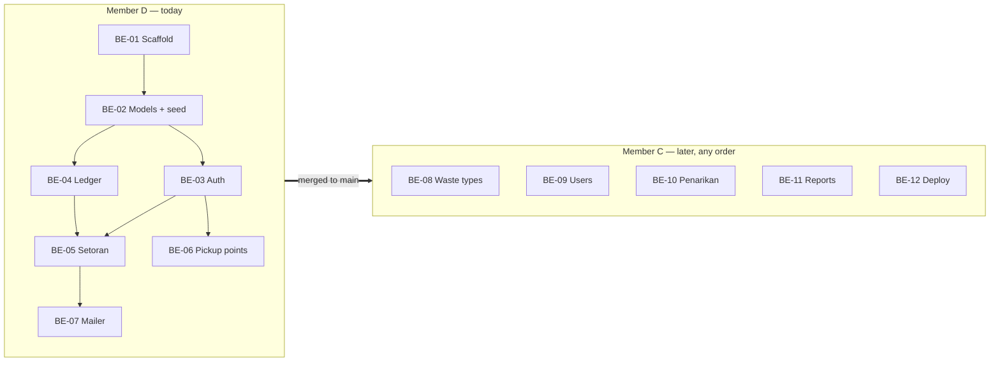

# Bank Sampah App — Task Distribution

Backend split between **Member C** and **Member D**. Frontend (Member A, Member B) comes later.

**Handoff model:** Member D builds first and finishes everything in one go. Member C continues later from `main`. So **none of Member D's tasks depend on Member C**, and Member C's tasks only depend on work Member D has already merged. Member C's tasks are also independent of each other, so they can be done in any order.

The rubric grades each person on finishing their agreed share (G2) and the team on a steady, incremental commit history (G3), so every task has one clear owner and lands in several small commits.

## 1. Overview

| ID | Task | Owner | Depends on |
|---|---|---|---|
| BE-01 | Workspace + backend scaffold | D | — |
| BE-02 | Mongoose models + seed | D | BE-01 |
| BE-03 | Auth + role middleware | D | BE-02 |
| BE-04 | Ledger (saldo & mutasi) service | D | BE-02 |
| BE-05 | Setoran (deposit) | D | BE-03, BE-04 |
| BE-06 | Pickup points & schedule | D | BE-03 |
| BE-07 | SendGrid mailer + setoran email | D | BE-05 |
| BE-08 | Waste types & prices CRUD | C | Member D's work |
| BE-09 | Users CRUD | C | Member D's work |
| BE-10 | Penarikan (withdrawal) + email | C | Member D's work |
| BE-11 | Reports | C | Member D's work |
| BE-12 | Deployment (Atlas + Railway) | C | Member D's work |

**Member D:** scaffold, models & seed, auth & security, ledger, setoran, pickup points, mailer.
**Member C:** waste types, users, penarikan, reports, deployment.

## 2. Task Details

### Member D

#### BE-01 — Workspace + backend scaffold
- Root `package.json` with npm workspaces (`backend`, `frontend`, `packages/*`).
- `backend/`: Express + TypeScript, `tsconfig.json`, dev script (tsx/nodemon), `app.ts`, `server.ts`.
- `lib/config.ts` env loader (validated with Zod), `lib/db.ts` Mongoose connect + `withTransaction(fn)` helper.
- `middlewares/error.middleware.ts` (central error handler, consistent JSON error shape), `middlewares/validate.middleware.ts` (Zod body/query validation).
- `packages/shared/` package set up and importable from `backend/`.
- `GET /api/health` returns OK + DB status.
- **Files:** `package.json`, `backend/src/{app,server}.ts`, `backend/src/lib/{config,db}.ts`, `backend/src/middlewares/*`, `packages/shared/*`

#### BE-02 — Mongoose models + seed
- All schemas: `User`, `JenisSampah`, `Setoran` (embedded items), `Penarikan`, `MutasiSaldo`, `TitikJemput` — fields per `architecture.md` §10. Includes `Penarikan` so Member C only writes the service.
- Indexes: unique `email`, `mutasiSaldo` by `nasabahId + tanggal`, `2dsphere` on `titikJemput.lokasi`.
- `seed.ts`: one admin, one petugas, one nasabah, sample waste types (PET plastic, cardboard, paper, cans, glass bottles) — setoran can be tested without the waste-type CRUD.
- **Files:** `backend/src/models/*`, `backend/src/seed.ts`

#### BE-03 — Auth + role middleware
- `POST /api/auth/register` (nasabah only), `POST /api/auth/login`, `POST /api/auth/logout`, `GET /api/auth/me`.
- bcrypt password hashing (rubric BE4); JWT in httpOnly cookie; inactive users rejected.
- `auth.middleware.ts` (verify token) + `requireRole(...roles)` guard (rubric BE5) — used by every other route.
- **Files:** `routes/auth.routes.ts`, `controllers/auth.controller.ts`, `services/auth.service.ts`, `middlewares/auth.middleware.ts`

#### BE-04 — Ledger service
- `ledger.service.ts`: `applyMutasi(session, { nasabahId, tipe, jumlah, refId })` updates saldo and writes a `mutasiSaldo` row with `saldoSetelah`, inside the caller's session. Rejects if saldo would go negative.
- `GET /api/saldo` (own saldo), `GET /api/saldo/mutasi` (paginated; nasabah: own; petugas/admin: `?nasabahId=`).
- **Files:** `services/ledger.service.ts`, `routes/saldo.routes.ts`, `controllers/saldo.controller.ts`

#### BE-05 — Setoran
- `POST /api/setoran` (petugas): look up current prices from `JenisSampah`, snapshot per item, compute subtotals + total, then in one transaction insert setoran + `applyMutasi(SETORAN)`.
- `GET /api/setoran` (petugas/admin: all with filters; nasabah: own), `GET /api/setoran/:id`.
- `PATCH /api/setoran/:id/batal` (petugas/admin): status `DIBATALKAN` + `applyMutasi(KOREKSI, -total)`.
- **Files:** `routes/setoran.routes.ts`, `controllers/setoran.controller.ts`, `services/setoran.service.ts`

#### BE-06 — Pickup points & schedule
- `GET /api/titik-jemput` (all roles), `POST`, `PATCH /:id`, `DELETE /:id` (admin only).
- Validate GeoJSON point (lng, lat) and schedule entries (day, start, end).
- **Files:** `routes/titik-jemput.routes.ts`, `controllers/titik-jemput.controller.ts`, `services/titik-jemput.service.ts`

#### BE-07 — SendGrid mailer + setoran email
- `lib/mailer.ts`: SendGrid client (`@sendgrid/mail`) with ready-to-use functions `sendSetoranEmail(...)` and `sendPenarikanStatusEmail(...)` (the second is used by Member C in BE-10).
- Hooked into setoran service after the transaction commits; failures logged, never thrown to the client.
- Env: `SENDGRID_API_KEY`, `SENDGRID_FROM_EMAIL` (verified sender). If the key is missing, the mailer logs instead of sending, so local dev works without SendGrid.
- **Files:** `backend/src/lib/mailer.ts`, hook in `services/setoran.service.ts`

### Member C

Everything below builds on Member D's merged work (scaffold, models, auth guard, ledger, mailer). Tasks are independent of each other.

#### BE-08 — Waste types & prices CRUD
- `GET /api/jenis-sampah` (all roles), `POST`, `PATCH /:id`, `DELETE /:id` (admin only; soft delete via `aktif=false` if already used in a setoran).
- **Uses:** `JenisSampah` model, `requireRole`.
- **Files:** `routes/jenis-sampah.routes.ts`, `controllers/jenis-sampah.controller.ts`, `services/jenis-sampah.service.ts`

#### BE-09 — Users CRUD
- Admin only: `GET /api/users` (search, filter by role, paginate), `GET /:id`, `POST` (create petugas/nasabah), `PATCH /:id` (edit, deactivate), `DELETE /:id`.
- Never return `passwordHash`; hash new passwords with the same helper as auth.
- **Uses:** `User` model, bcrypt helper from `auth.service.ts`, `requireRole`.
- **Files:** `routes/users.routes.ts`, `controllers/users.controller.ts`, `services/users.service.ts`

#### BE-10 — Penarikan + email
- `POST /api/penarikan` (nasabah): amount ≤ saldo − pending total; method `TUNAI` or `E_WALLET` (provider + number required).
- `GET /api/penarikan` (nasabah: own; petugas/admin: all, filter by status).
- `PATCH /api/penarikan/:id/setujui` (petugas): inside `withTransaction`, set status + `applyMutasi(PENARIKAN)`. `PATCH /:id/tolak` with note.
- After commit, call `sendPenarikanStatusEmail(...)`.
- **Uses:** `Penarikan` model, `withTransaction`, `applyMutasi`, mailer, `requireRole`.
- **Files:** `routes/penarikan.routes.ts`, `controllers/penarikan.controller.ts`, `services/penarikan.service.ts`

#### BE-11 — Reports
- Admin only. MongoDB aggregation pipelines over `setoran`, `penarikan`, `users`.
- `GET /api/laporan/ringkasan?from=&to=`: total kg, total value, total withdrawals, saldo in circulation, active nasabah count, most active nasabah.
- `GET /api/laporan/per-jenis?from=&to=`: kg + value per waste type, grouped per day/month for charts.
- Works on seeded + test setoran data even before BE-10 lands (withdrawal totals just return 0).
- **Files:** `routes/laporan.routes.ts`, `controllers/laporan.controller.ts`, `services/laporan.service.ts`

#### BE-12 — Deployment
- MongoDB Atlas M0 cluster, DB user, network access for Railway.
- Railway service for `backend/`, build + start commands, env vars (`MONGODB_URI`, `JWT_SECRET`, SendGrid keys, `FRONTEND_URL`).
- CORS allow-list for the Vercel domain; cookie `SameSite=None; Secure` in production.
- Run seed on first deploy; share the public API URL with the frontend members.

## 3. Definition of Done (every task)

- Request/response Zod schemas live in `packages/shared` and are used for validation.
- Correct role guard on every route.
- Tested manually with the shared Postman collection (`docs/postman/`), including one failure case (wrong role, invalid body).
- Endpoints listed in the collection with example requests.
- Small commits following the repo rule (`type(scope): message`, one change per commit).

## 4. Working Agreement

- One branch per task: `be/<id>-<short-name>` (e.g. `be/05-setoran`).
- Member D merges all BE-01…BE-07 to `main` before handing off; Member C branches from that `main`.
- PRs reviewed by the other backend member when available; Member D's PRs can be reviewed by Member C afterwards.
- Changes to `packages/shared` schemas are announced to the whole team — frontend depends on them.

## 5. Frontend — TBD

Member A and Member B tasks will be added once the backend API contract is stable.
