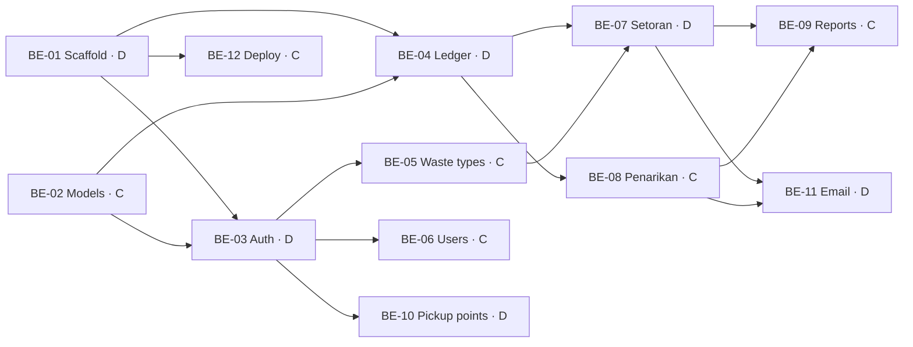

# Bank Sampah App — Task Distribution

Backend split between **Member C** and **Member D**. Frontend (Member A, Member B) comes later.

The rubric grades each person on finishing their agreed share (G2) and the team on a steady, incremental commit history (G3), so every task has one clear owner and is small enough to land in several commits.

## 1. Overview

| ID | Task | Owner | Phase | Depends on |
|---|---|---|---|---|
| BE-01 | Workspace + backend scaffold | D | 0 — Foundation | — |
| BE-02 | Mongoose models + seed | C | 0 — Foundation | — |
| BE-03 | Auth + role middleware | D | 1 — Core | BE-01, BE-02 |
| BE-04 | Ledger (saldo & mutasi) service | D | 1 — Core | BE-01, BE-02 |
| BE-05 | Waste types & prices CRUD | C | 1 — Core | BE-02, BE-03 |
| BE-06 | Users CRUD | C | 1 — Core | BE-02, BE-03 |
| BE-07 | Setoran (deposit) | D | 2 — Money flows | BE-04, BE-05 |
| BE-08 | Penarikan (withdrawal) | C | 2 — Money flows | BE-04 |
| BE-09 | Reports | C | 3 — Reports & extras | BE-07, BE-08 |
| BE-10 | Pickup points & schedule | D | 3 — Reports & extras | BE-03 |
| BE-11 | SendGrid email | D | 3 — Reports & extras | BE-07, BE-08 |
| BE-12 | Deployment (Atlas + Railway) | C | 3 — Reports & extras | BE-01 |

**Member D:** scaffold, auth & security, ledger, setoran, pickup points, email.
**Member C:** models & seed, waste types, users, penarikan, reports, deployment.

## 2. Task Details

### Phase 0 — Foundation (C and D work in parallel)

#### BE-01 — Workspace + backend scaffold (Member D)
- Root `package.json` with npm workspaces (`backend`, `frontend`, `packages/*`).
- `backend/`: Express + TypeScript, `tsconfig.json`, dev script (tsx/nodemon), `app.ts`, `server.ts`.
- `lib/config.ts` env loader (validated with Zod), `lib/db.ts` Mongoose connect.
- `middlewares/error.middleware.ts` (central error handler, consistent JSON error shape), `middlewares/validate.middleware.ts` (Zod body/query validation).
- `packages/shared/` package set up and importable from `backend/`.
- `GET /api/health` returns OK + DB status.
- **Files:** `package.json`, `backend/src/{app,server}.ts`, `backend/src/lib/{config,db}.ts`, `backend/src/middlewares/*`, `packages/shared/*`

#### BE-02 — Mongoose models + seed (Member C)
- Schemas: `User`, `JenisSampah`, `Setoran` (embedded items), `Penarikan`, `MutasiSaldo`, `TitikJemput` — fields per `architecture.md` §10.
- Indexes: unique `email`, `mutasiSaldo` by `nasabahId + tanggal`, `2dsphere` on `titikJemput.lokasi`.
- `seed.ts`: one admin account, one petugas, sample waste types (PET plastic, cardboard, paper, cans, glass bottles).
- **Files:** `backend/src/models/*`, `backend/src/seed.ts`

### Phase 1 — Core

#### BE-03 — Auth + role middleware (Member D)
- `POST /api/auth/register` (nasabah only), `POST /api/auth/login`, `POST /api/auth/logout`, `GET /api/auth/me`.
- bcrypt password hashing (rubric BE4); JWT in httpOnly cookie; inactive users rejected.
- `auth.middleware.ts` (verify token) + `requireRole(...roles)` guard (rubric BE5) — used by every other task.
- **Files:** `routes/auth.routes.ts`, `controllers/auth.controller.ts`, `services/auth.service.ts`, `middlewares/auth.middleware.ts`

#### BE-04 — Ledger service (Member D)
- `ledger.service.ts`: `applyMutasi(session, { nasabahId, tipe, jumlah, refId })` updates saldo and writes a `mutasiSaldo` row with `saldoSetelah`, inside the caller's Mongoose session. Rejects if saldo would go negative.
- `GET /api/saldo` (own saldo), `GET /api/saldo/mutasi` (paginated, nasabah: own; petugas/admin: `?nasabahId=`).
- Shared helper `withTransaction(fn)` in `lib/db.ts`.
- **Files:** `services/ledger.service.ts`, `routes/saldo.routes.ts`, `controllers/saldo.controller.ts`

#### BE-05 — Waste types & prices CRUD (Member C)
- `GET /api/jenis-sampah` (all roles), `POST`, `PATCH /:id`, `DELETE /:id` (admin only; soft delete via `aktif=false` if already used in a setoran).
- **Files:** `routes/jenis-sampah.routes.ts`, `controllers/jenis-sampah.controller.ts`, `services/jenis-sampah.service.ts`

#### BE-06 — Users CRUD (Member C)
- Admin only: `GET /api/users` (search, filter by role, paginate), `GET /:id`, `POST` (create petugas/nasabah), `PATCH /:id` (edit, deactivate), `DELETE /:id`.
- Never return `passwordHash`.
- **Files:** `routes/users.routes.ts`, `controllers/users.controller.ts`, `services/users.service.ts`

### Phase 2 — Money flows

#### BE-07 — Setoran (Member D)
- `POST /api/setoran` (petugas): look up current prices, snapshot per item, compute subtotals + total, then in one transaction insert setoran + `applyMutasi(SETORAN)`.
- `GET /api/setoran` (petugas/admin: all with filters; nasabah: own), `GET /api/setoran/:id`.
- `PATCH /api/setoran/:id/batal` (petugas/admin): status `DIBATALKAN` + `applyMutasi(KOREKSI, -total)`.
- **Files:** `routes/setoran.routes.ts`, `controllers/setoran.controller.ts`, `services/setoran.service.ts`

#### BE-08 — Penarikan (Member C)
- `POST /api/penarikan` (nasabah): amount ≤ saldo − pending total; method `TUNAI` or `E_WALLET` (provider + number required).
- `GET /api/penarikan` (nasabah: own; petugas/admin: all, filter by status).
- `PATCH /api/penarikan/:id/setujui` (petugas): in one transaction set status + `applyMutasi(PENARIKAN)`. `PATCH /:id/tolak` with note.
- **Files:** `routes/penarikan.routes.ts`, `controllers/penarikan.controller.ts`, `services/penarikan.service.ts`

### Phase 3 — Reports & extras

#### BE-09 — Reports (Member C)
- Admin only. MongoDB aggregation pipelines.
- `GET /api/laporan/ringkasan?from=&to=`: total kg, total value, total withdrawals, saldo in circulation, active nasabah count, most active nasabah.
- `GET /api/laporan/per-jenis?from=&to=`: kg + value per waste type, grouped per day/month for charts.
- **Files:** `routes/laporan.routes.ts`, `controllers/laporan.controller.ts`, `services/laporan.service.ts`

#### BE-10 — Pickup points & schedule (Member D)
- `GET /api/titik-jemput` (all roles), `POST`, `PATCH /:id`, `DELETE /:id` (admin only).
- Validate GeoJSON point (lng, lat) and schedule entries (day, start, end).
- **Files:** `routes/titik-jemput.routes.ts`, `controllers/titik-jemput.controller.ts`, `services/titik-jemput.service.ts`

#### BE-11 — SendGrid email (Member D)
- `lib/mailer.ts`: SendGrid client (`@sendgrid/mail`), templates "deposit recorded" and "withdrawal approved/rejected".
- Called after the transaction commits in setoran & penarikan services; failures logged, never thrown to the client.
- Env: `SENDGRID_API_KEY`, `SENDGRID_FROM_EMAIL` (verified sender).
- Coordinate with Member C for the hook inside `penarikan.service.ts`.
- **Files:** `backend/src/lib/mailer.ts`, small hooks in `services/setoran.service.ts` and `services/penarikan.service.ts`

#### BE-12 — Deployment (Member C)
- MongoDB Atlas M0 cluster, DB user, network access for Railway.
- Railway service for `backend/`, build + start commands, env vars (`MONGODB_URI`, `JWT_SECRET`, SendGrid keys, `FRONTEND_URL`).
- CORS allow-list for the Vercel domain; cookie `SameSite=None; Secure` in production.
- Run seed on first deploy; share the public API URL with the frontend members.

## 3. Definition of Done (every task)

- Request/response Zod schemas live in `packages/shared` and are used for validation.
- Correct role guard on every route.
- Tested manually with the shared Postman collection (`docs/postman/`), including one failure case (wrong role, invalid body).
- Endpoints listed in the collection with example requests.
- Small commits following the repo rule (`type(scope): message`, one change per commit).

## 4. Working Agreement

- One branch per task: `be/<id>-<short-name>` (e.g. `be/07-setoran`).
- Open a PR to `main`; the other backend member reviews before merge.
- Changes to `packages/shared` schemas are announced to the whole team — frontend depends on them.
- Blocked on a dependency? Build against the agreed schema in `packages/shared` and stub the missing part until it lands.

## 5. Frontend — TBD

Member A and Member B tasks will be added once the backend API contract (Phase 1) is stable.
